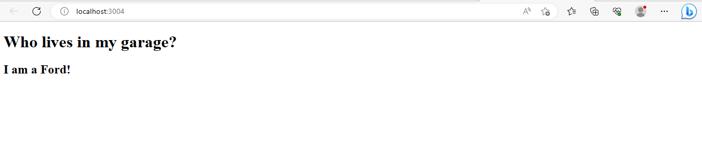
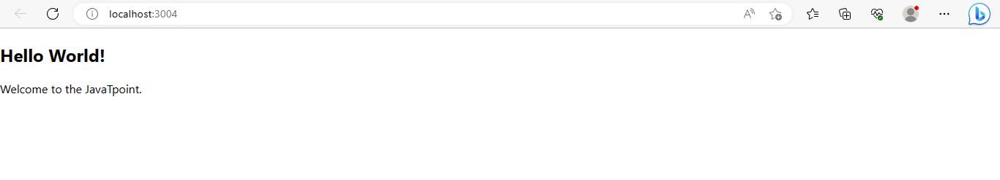
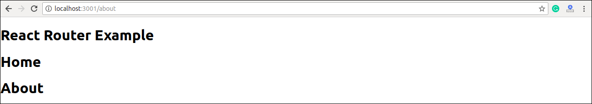
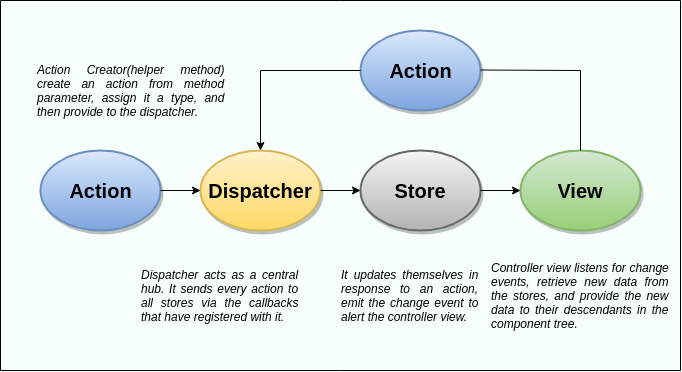

# React

React is a JavaScript library for building user interfaces.

React is used to build single-page applications.

React allows us to create reusable UI components.


**-->Define UI**

The User Interface (UI) is the point of human-computer interaction and communication in a device.This can include display screens,keyboard, a mouse and the appearance of a desktop.

##  what is React?

React, sometimes referred to as a frontend JavaScript framework, is a JavaScript library created by Facebook.

React is a tool for building UI components.

It is also known as ReactJs and React.js , so don't get confused if you read different notation in different places.

React knows only one thing that is to create an awesome UI.

<!--style="font-size:30px"-->
* Why React?

Created and Maintained By facebook.

It has a huge community in github.

Component Based architecture.

### How does React works?

React creates a VIRTUAL DOM in memory.

Instead of manipulating the browser's DOM directly, React creates a virtual DOM in memory, where it does all the necessary manipulating, before making the changes in the browser DOM.

React only changes what needs to be changed!

React finds out what changes have been made, and changes only what needs to be changed.

### React.js History

Current version of React.JS is V18.0.0 (April 2022).

Initial Release to the Public (V0.3.0) was in July 2013.

React.JS was first used in 2011 for Facebook's Newsfeed feature.

Facebook Software Engineer, Jordan Walke, created it.

Current version of create-react-app is v5.0.1 (April 2022).

create-react-app includes built tools such as webpack, Babel, and ESLint.

### React Features

JSX − JSX is JavaScript syntax extension. It isn't necessary to use JSX in React development, but it is recommended.

Components − React is all about components. You need to think of everything as a component. This will help you maintain the code when working on larger scale projects.

Unidirectional data flow and Flux − React implements one-way data flow which makes it easy to reason about your app. Flux is a pattern that helps keeping your data unidirectional.

License − React is licensed under the Facebook Inc. Documentation is licensed under CC BY 4.0.

### React Advantage

Uses virtual DOM which is a JavaScript object. This will improve apps performance, since JavaScript virtual DOM is faster than the regular DOM.

Can be used on client and server side as well as with other frameworks.

Component and data patterns improve readability, which helps to maintain larger apps.

### React Limitations

Covers only the view layer of the app, hence you still need to choose other technologies to get a complete tooling set for development.

Uses inline templating and JSX, which might seem awkward to some developers.

<!--style="font-size:30px"-->
* Prerequisites for React?

1: Basic Knowledge of Html , css and Javascript.

2: Basic Understanding of ES6 Features.

3: Basic Understanding of how to use npm(Node Package Manager).


# Installation of React

<!--style="font-size:30px"-->
1. install Node.js

Node.js actually provides a runtime environment to execute JavaScript code from outside a browser. NPM, the 

default package manager for Nodejs is used for managing and sharing the packages for any JavaScript project. 

React uses Node.js and NPM for the management of dependencies and runtime.

In this tutorial, we are going to install the create-react-app tool using the Node Package Manager(NPM). 

Create-react-app is a tool developed by the React.js team that makes React’s setting up easier.

So first, it needs to install Nodejs on our system. NPM will be installed with Nodejs. The current stable 

version of Node.js can be downloaded and installed from the official website that is given below.

---> https://nodejs.org

Download the latest version and install it. Here we can choose the LTS or the latest version. Because both of 

the version supports React.

After the installation, check the versions using the below commands.

---> node -v

---> npm -v

This will show the installed versions of Node.js and NPM.

<!--style="font-size:30px"-->
2. Install visual Studio code /Sublime/Atom/Brackets.

<!--style="font-size:30px"-->
3. Create a New React Project

After the successful installation of Nodejs and NPM, we can create a new React project by temporarily 

installing the create-react-app tool. Execute the below command on the Command prompt window.

---> npx create-react-app awesome-project

Here NPX will temporarily install create-react-app and create a new react project named awesome-project. Note 

that the awesome-project is the name I have chosen for my react project.

<!--style="font-size:30px"-->
4. Running the Application

So the app we created can run locally on our system with the npm start command.

---> cd awesome-project

To start the server for the development:

---> npm start

This will open up the react application in a new tab of our browser with the below URL.

---> http://localhost:3000

<br>


# React File and Folder Structure

In React application, there are several files and folders in the root directory. Some of them are as follows:

1. node_modules: It contains the React library and any other third party libraries needed.

2. public: It holds the public assets of the application. It contains the index.html where React will mount 

the application by default on the` <div id="root"></div>` element.

3. src: It contains the App.css, App.js, App.test.js, index.css, index.js, and serviceWorker.js files. Here, 

the App.js file always responsible for displaying the output screen in React.

4. package-lock.json: It is generated automatically for any operations where npm package modifies either the 

node_modules tree or package.json. It cannot be published. It will be ignored if it finds any other place 

rather than the top-level package.

5. package.json: It holds various metadata required for the project. It gives information to npm, which 

allows to identify the project as well as handle the project?s dependencies.

6. README.md: It provides the documentation to read about React topics.

# React Environment Setup

Now, open the src >> App.js file and make changes which you want to display on the screen. After making 

desired changes, save the file. As soon as we save the file, Webpack recompiles the code, and the page will 

refresh automatically, and changes are reflected on the browser screen. Now, we can create as many components 

as we want, import the newly created component inside the App.js file and that file will be included in our 

main index.html file after compiling by Webpack.

Next, if we want to make the project for the production mode, type the following command. This command will 

generate the production build, which is best optimized.

---> $ npm build  


# React ES6

What is ES6?

ES6 stands for ECMAScript 6.

ECMAScript was created to standardize JavaScript, and ES6 is the 6th version of ECMAScript, it was published in 2015, and is also known as ECMAScript 2015.

Why should I learn ES6?

React uses ES6, and you should be familiar with some of the new features like:

1. Classes
2. Arrow Functions
3. Variables (let, const, var)
4. Array Methods like .map()
5. Destructuring
6. Modules
7. Ternary Operator
8. Spread Operator

## ES6 Classes

ES6 introduced classes.

A class is a type of function, but instead of using the keyword function to initiate it, we use the keyword class, and the properties are assigned inside a constructor() method.

Example:

```markdown
<!DOCTYPE html>
<html>

<body>
  
<script>
class Car {
  constructor(name) {
    this.brand = name;
  }
}

const mycar = new Car("Ford");

document.write(mycar.brand);
</script>

</body>
</html>
```


Note: The constructor function is called automatically when the object is initialized.

<!--style="font-size:30px;color:blue;"-->
Method in classes

You can add your own methods in a class:

Example

Create a method named "present":

```markdown

<!DOCTYPE html>
<html>

<body>
  
<script>
class Car {
  constructor(name) {
    this.brand = name;
  }

  present() {
    return 'I have a ' + this.brand;
  }
}

const mycar = new Car("Ford");
document.write(mycar.present());
</script>

</body>
</html>
```
<!--style="font-size:30px"-->
Output 

```markdown
I have a Ford
```


As you can see in the example above, you call the method by referring to the object's method name followed by parentheses (parameters would go inside the parentheses).

<!--style="font-size:30px;color:Red;"-->
 Class Inheritance

To create a class inheritance, use the extends keyword.

A class created with a class inheritance inherits all the methods from another class:

Example

Create a class named "Model" which will inherit the methods from the "Car" class:

```markdown

<!DOCTYPE html>
<html>

<body>
  
<script>
class Car {
  constructor(name) {
    this.brand = name;
  }

  present() {
    return 'I have a ' + this.brand;
  }
}

class Model extends Car {
  constructor(name, mod) {
    super(name);
    this.model = mod;
  }  
  show() {
    return this.present() + ', it is a ' + this.model
  }
}

const mycar = new Model("Ford", "Mustang");
document.write(mycar.show());
</script>

</body>
</html>
```

<!--style="font-size:30px"-->
Output 

```console
I have a Ford, it is a Mustang
```

The super() method refers to the parent class.

By calling the super() method in the constructor method, we call the parent's constructor method and get 

access to the parent's properties and methods.

### ES6 Arrow Functions

The arrow function is a new feature of ES6, introduced in ReactJS 16. It allows the developer to create a 

function that has lexical “this” binding and no arguments.

Arrow functions offer a compressed and short version of a function expression and need fewer keystrokes than 

regular JavaScript functions from the developer and can be used as a simpler alternative to functions within 

class components and functional components and event handlers in React.

Arrow functions are always anonymous, meaning there is no need to use the keyword “function” when defining 

them. They also do not have their own this value, meaning that this inside an arrow function will refer to 

the one where it was created rather than where it was called from.

The third difference between regular JavaScript functions and arrow functions is that all arguments passed 

into an arrow function must be pre−defined, because there is no need for them to be assigned as default 

values like with regular JavaScript functions.

Arrow functions allow us to write shorter function syntax

<!--style="font-size:30px"-->
When to use Arrow Functions?

Arrow functions are great for performance and making declarative code more readable.

Although they are not always the best choice, they do have some advantages that make them worth considering.

In answer to the question, When to use them?, here are some scenarios −

* When you need to bind this to a method

* When you want a method to be called on a component's props

* When you want to use a callback function

<!--style="font-size:30px"-->
Why Should You Use Arrow Functions in React?

* First, they are much simpler to write and understand than traditional function expressions. This can make 

your code more readable and easier to debug.

* Second, arrow functions do not create a new scope, so they can be used in ReactJS without polluting the 

global scope.

* Finally, arrow functions can be used as arguments to other functions, which can make your code more 

flexible and expressive.

<!--style="font-size:30px"-->
Example 

Before:

```markdown

<!DOCTYPE html>
<html>

<body>

<h1>Function</h1>

<p>This demonstrates a regular function, NOT an arrow function.</p>

<p id="demo"></p>
  
<script>
hello = function() {
  return "Hello World!";
}

document.getElementById("demo").innerHTML = hello();
</script>

</body>
</html>
```


<!--style="font-size:30px"-->
Example 

With Arrow Function:

```markdown

<!DOCTYPE html>
<html>

<body>

<h1>Arrow Function</h1>

<p>A demonstration of a simple arrow function.</p>

<p id="demo"></p>
  
<script>
hello = () => {
  return "Hello World!";
}

document.getElementById("demo").innerHTML = hello();
</script>

</body>
</html>
```


<!--style="font-size:30px"-->
Example 

Arrow Function With Parameters:

```markdown

<!DOCTYPE html>
<html>

<body>

<h1>Arrow Function</h1>

<p>A demonstration of an arrow function in one line, with parameters.</p>

<p id="demo"></p>
  
<script>
hello = (val) => "Hello " + val;

document.getElementById("demo").innerHTML = hello("World");
</script>

</body>
</html>
```


### ES6 Variable

Before ES6 there was only one way of defining your variables: with the var keyword. If you did not define them, they would be assigned to the global object. Unless you were in strict mode, then you would get an error if your variables were undefined.

Now, with ES6, there are three ways of defining your variables: var, let, and const.

<!--style="font-size:30px"-->
* Var

If you use var outside of a function, it belongs to the global scope.

If you use var inside of a function, it belongs to that function.

If you use var inside of a block, i.e. a for loop, the variable is still available outside of that block.

var has a function scope, not a block scope.

Example:

var x = 5.6;

<!--style="font-size:30px"-->
* let

let is the block scoped version of var, and is limited to the block (or expression) where it is defined.

If you use let inside of a block, i.e. a for loop, the variable is only available inside of that loop.

let has a block scope.

Example

let x = 5.6;

<!--style="font-size:30px"-->
* const

const is a variable that once it has been created, its value can never change.

const has a block scope.

The keyword const is a bit misleading.

It does not define a constant value. It defines a constant reference to a value.

Because of this you can NOT:

Reassign a constant value

Reassign a constant array

Reassign a constant object

But you CAN:

Change the elements of constant array

Change the properties of constant object

Example:

const x = 5.6;

### ES6 Array Method

There are many JavaScript array methods.

One of the most useful in React is the .map() array method.

The .map() method allows you to run a function on each item in the array, returning a new array as the result.

In React, map() can be used to generate lists.

Example:

Generate a list of items from an array:

```markdown

import React from 'react';
import ReactDOM from 'react-dom/client';

const myArray = ['apple', 'banana', 'orange'];

const myList = myArray.map((item) => <p>{item}</p>)

ReactDOM.render(myList, document.getElementById('root'));

```

<!--style="font-size:30px"-->
Output


### ES6 Destructuring

To illustrate destructuring, we'll make a sandwich. Do you take everything out of the refrigerator to make your sandwich? No, you only take out the items you would like to use on your sandwich.

Destructuring is exactly the same. We may have an array or object that we are working with, but we only need some of the items contained in these.

Destructuring makes it easy to extract only what is needed.

Destructuring Arrays 

Here is the old way of assigning array items to a variable:

Example:

Before

```markdown
const vehicles = ['mustang', 'f-150', 'expedition'];

// old way
const car = vehicles[0];
const truck = vehicles[1];
const suv = vehicles[2];
```

Example:

With Destructuring

```markdown
const vehicles = ['mustang', 'f-150', 'expedition'];

const [car, truck, suv] = vehicles;
```

When destructuring arrays, the order that variables are declared is important.

---> Destructuring Objects

Here is the old way of using an object inside a function:


Example:

Before

```markdown
const vehicleOne = {
  brand: 'Ford',
  model: 'Mustang',
  type: 'car',
  year: 2021, 
  color: 'red'
}

myVehicle(vehicleOne);

// old way
function myVehicle(vehicle) {
  const message = 'My ' + vehicle.type + ' is a ' + vehicle.color + ' ' + vehicle.brand + ' ' + vehicle.model + '.';
}
```

Example:

With Destructuring

```markdown
const vehicleOne = {
  brand: 'Ford',
  model: 'Mustang',
  type: 'car',
  year: 2021, 
  color: 'red'
}

myVehicle(vehicleOne);

function myVehicle({type, color, brand, model}) {
  const message = 'My ' + type + ' is a ' + color + ' ' + brand + ' ' + model + '.';
}
```

<!--style="font-size:30px"-->
Output

```markdown
My car is a red Ford Mustang.
```


### ES6 Spread Operator

ES6 introduced a new operator referred to as a spread operator, which consists of three dots (...). It allows an iterable to expand in places where more than zero arguments are expected. It gives us the privilege to obtain the parameters from an array.

Spread operator syntax is similar to the rest parameter, but it is entirely opposite of it. Let's understand the syntax of the spread operator.

<!--style="font-size:30px;color:red;"-->
Syntax

```markdown

var variablename1 = [...value];  
```
The three dots (...) in the above syntax are the spread operator, which targets the entire values in the 

particular variable.

Example:

```markdown
<!DOCTYPE html>
<html>

<body>

<script>
const numbersOne = [1, 2, 3];
const numbersTwo = [4, 5, 6];
const numbersCombined = [...numbersOne, ...numbersTwo];

document.write(numbersCombined);
</script>

</body>
</html>
```


The spread operator is often used in combination with destructuring.

Example:

Assign the first and second items from numbers to variables and put the rest in an array:

```markdown
<!DOCTYPE html>
<html>

<body>

<script>
const numbers = [1, 2, 3, 4, 5, 6];

const [one, two, ...rest] = numbers;

document.write("<p>" + one + "</p>");
document.write("<p>" + two + "</p>");
document.write("<p>" + rest + "</p>");
</script>

</body>
</html>
```


---> We can use the spread operator with objects too:

Example:

Combines these Two Objects

```markdown
<!DOCTYPE html>
<html>

<body>

<script>
const myVehicle = {
  brand: 'Ford',
  model: 'Mustang',
  color: 'red'
}

const updateMyVehicle = {
  type: 'car',
  year: 2021, 
  color: 'yellow'
}

const myUpdatedVehicle = {...myVehicle, ...updateMyVehicle}

//Check the result object in the console:
console.log(myUpdatedVehicle);
</script>

<p>Press F12 and see the result object in the console view.</p>

</body>
</html>
```


Notice the properties that did not match were combined, but the property that did match, color, was overwritten by the last object that was passed, updateMyVehicle.

### ES6 Rest Parameter

The rest parameter is introduced in ECMAScript 2015 or ES6, which improves the ability to handle parameters. 

The rest parameter allows us to represent an indefinite number of arguments as an array. By using the rest 

parameter, a function can be called with any number of arguments.

Before ES6, the arguments object of the function was used. The arguments object is not an instance of the 

Array type. Therefore, we can't use the filter() method directly.

The rest parameter is prefixed with three dots (...). Although the syntax of the rest parameter is similar to 

the spread operator, it is entirely opposite from the spread operator. The rest parameter has to be the last 

argument because it is used to collect all of the remaining elements into an array.

<!--style="font-size:30px;color:red;"-->
Syntax

```markdown
function fun(a, b, ...theArgs) {  
  // statements  
}  

```
<!--style="font-size:30px"-->
Example

```markdown

function show(...args) {  
  let sum = 0;  
  for (let i of args) {  
      sum += i;  
  }  
  console.log("Sum = "+sum);  
}  
  
show(10, 20, 30);  
```

* All the arguments that we have passed in the function will map to the parameter list. As stated above, the 

rest parameter (...) should always be at last in the list of arguments. If we place it anywhere else, it will 

cause an error.

<!--style="font-size:30px"-->
Difference between Rest Parameter and arguments object

The rest parameter and arguments object are different from each other. Let's see the difference between the 

rest parameter and the arguments object:

* The arguments object is an array-like (but not array), while the rest parameters are array instances. The 

arguments object does not include methods such as sort, map, forEach, or pop, but these methods can be 

directly used in rest parameters.

<!--style="font-size:30px"-->
Rest Parameters and Destructuring

Destructuring means to break down a complex structure into simpler parts. We can define an array as the rest 

parameter. The passed-in arguments will be broken down into the array. Rest parameter supports array 

destructuring only.

By using the rest parameter, we can put all the remaining elements of an array in a new array.

Let's see an illustration of the same.

<!--style="font-size:30px"-->
Example

```markdown

var colors = ["Violet", "Indigo", "Blue", "Green", "Yellow", "Orange", "Red"];    
    
// destructuring assignment    
var [a,b,...args] = colors;    
console.log(a);     
console.log(b);     
console.log(args);  
```

<!--style="font-size:30px"-->
Rest Parameter in a dynamic function

JavaScript allows us to create dynamic functions by using the function constructor. We can use the rest 

parameter within a dynamic function.

<!--style="font-size:30px"-->
Example

```markdown

let num = new Function('...args','return args');  
console.log(num(10, 20, 30)); 
```


### ES6 Ternary Operator

The ternary operator is a simplified conditional operator like if / else.

<!--style="font-size:30px"-->
Syntax:


```htm
condition ? <expression if true> : <expression if false>
```
 

Here is an example using if / else:

Example 

Before:

```markdown
<!DOCTYPE html>
<html>

<body>

<h1 id="demo"></h1>

<script>
function renderApp() {
  document.getElementById("demo").innerHTML = "Welcome!";
}

function renderLogin() {
  document.getElementById("demo").innerHTML = "Please log in";
}

let authenticated = true;

if (authenticated) {
  renderApp();
} else {
  renderLogin();
}

</script>

<p>Try changing the "authenticated" variable to false, and run the code to see what happens.</p>
</body>
</html>
```


<!--style="font-size:30px"-->
Example with Ternary Operator:

```markdown
<!DOCTYPE html>
<html>

<body>

<h1 id="demo"></h1>

<script>
function renderApp() {
  document.getElementById("demo").innerHTML = "Welcome!";
}

function renderLogin() {
  document.getElementById("demo").innerHTML = "Please log in";
}

let authenticated = true;

authenticated ? renderApp() : renderLogin();

</script>

<p>Try changing the "authenticated" variable to false, and run the code to see what happens.</p>
</body>
</html>
```


<!--style="font-size:30px"-->
Example Of Rendering Condition (Using Ternary Operator on React)

Condition.js

```markdown
import{useState} from 'react'

function Condition(){

    const [loggedIn , setLoggedIn] = useState(false)
    const [logIn , setLogIn] = useState(3)

    return(
        <div>
          {loggedIn?<h1>Welcome Anil</h1>:<h1>Welcome Guest</h1>}
          {logIn==1?<h1>welcome user 1</h1>:logIn==2?<h1>welcome user 2</h1>:<h1>welcome user 3</h1>}
        </div>
    )
}
export default Condition;
```

App.js

```markdown
import logo from './logo.svg';
import './App.css';
import Condition from './Condition'

function App() {
  return (
    <div className="App">
  <Condition />
    </div>
  );
}

export default App;
```


# React Render HTML

React's goal is in many ways to render HTML in a web page.

React renders HTML to the web page by using a function called ReactDOM.render().

<!--style="font-size:30px"-->
The createRoot Function

* The createRoot() function takes one argument, an HTML element.

* The purpose of the function is to define the HTML element where a React component should be displayed.

<!--style="font-size:30px"-->
The Render Function

The ReactDOM.render() function takes two arguments, HTML code and an HTML element.

The purpose of the function is to display the specified HTML code inside the specified HTML element.

But render where?

There is another folder in the root directory of your React project, named "public". In this folder, there is an index.html file.

You'll notice a single `<div>` in the body of this file. This is where our React application will be rendered.

Example

Display a paragraph inside an element with the id of "root":

```markdown
import React from 'react';
import ReactDOM from 'react-dom/client';

ReactDOM.render(<p>Hello</p>, document.getElementById('root'));
```

<!--style="font-size:30px"-->
Output


Note that the element id does not have to be called "root", but this is the standard convention.

<!--style="font-size:30px"-->
* The HTML Code

The HTML code in this tutorial uses JSX which allows you to write HTML tags inside the JavaScript code:

Do not worry if the syntax is unfamiliar, you will learn more about JSX in the next chapter.

Example

Create a variable that contains HTML code and display it in the "root" node:

```markdown
import React from 'react';
import ReactDOM from 'react-dom/client';

const myelement = (
  <table>
    <tr>
      <th>Name</th>
    </tr>
    <tr>
      <td>John</td>
    </tr>
    <tr>
      <td>Elsa</td>
    </tr>
  </table>
);

ReactDOM.render(myelement, document.getElementById('root'));
```

<!--style="font-size:30px"-->
Output


<!--style="font-size:30px"-->
* The Root Node

The root node is the HTML element where you want to display the result.

It is like a container for content managed by React.

It does NOT have to be a `<div>` element and it does NOT have to have the id='root':

Example

The root node can be called whatever you like:

```markdown
import React from 'react';
import ReactDOM from 'react-dom/client';

ReactDOM.render(<p>Hallo</p>, document.getElementById('sandy'));

/*
For this example to work on your project,
you must have a element with
id="sandy" on your "index.html" page.
*/
```
<!--style="font-size:30px"-->
Output


# React Jsx

<!--style="font-size:30px"-->
What is Jsx?

JSX stands for JavaScript XML.

JSX allows us to write HTML in React.

JSX makes it easier to write and add HTML in React.

<!--style="font-size:30px"-->
* Coding Jsx

JSX allows us to write HTML elements in JavaScript and place them in the DOM without any createElement()  and/or appendChild() methods.

JSX converts HTML tags into react elements.

You are not required to use JSX, but JSX makes it easier to write React applications.

Here are two examples. The first uses JSX and the second does not:

<!--style="font-size:30px"-->
Example 1

Jsx:

```markdown

import React from 'react';
import ReactDOM from 'react-dom/client';

const myElement = <h1>I Love JSX!</h1>;

const root = ReactDOM.createRoot(document.getElementById('root'));
root.render(myElement);
```


<!--style="font-size:30px"-->
Example 2

Without Jsx:

```markdown

import React from 'react';
import ReactDOM from 'react-dom/client';

const myElement = React.createElement('h1', {}, 'I do not use JSX!');

const root = ReactDOM.createRoot(document.getElementById('root'));
root.render(myElement);
```


As you can see in the first example, JSX allows us to write HTML directly within the JavaScript code.

JSX is an extension of the JavaScript language based on ES6, and is translated into regular JavaScript at runtime.

<!--style="font-size:30px"-->
* Expressions in jsx:

With JSX you can write expressions inside curly braces { }.

The expression can be a React variable, or property, or any other valid JavaScript expression. JSX will execute the expression and return the result:

<!--style="font-size:30px"-->
Example

Execute the expression 5 + 5:

```markdown

import React from 'react';
import ReactDOM from 'react-dom/client';

const myElement = <h1>React is {5 + 5} times better with JSX</h1>;

const root = ReactDOM.createRoot(document.getElementById('root'));
root.render(myElement);
```


<!--style="font-size:30px"-->
* Inserting a Large Block of HTML

To write HTML on multiple lines, put the HTML inside parentheses:

<!--style="font-size:30px"-->
Example

Create a list with three list items:

```markdown

import React from 'react';
import ReactDOM from 'react-dom/client';

const myElement = (
  <ul>
    <li>Apples</li>
    <li>Bananas</li>
    <li>Cherries</li>
  </ul>
);

const root = ReactDOM.createRoot(document.getElementById('root'));
root.render(myElement);
```


<!--style="font-size:30px"-->
* One Top Level Element

The HTML code must be wrapped in ONE top level element.

So if you like to write two paragraphs, you must put them inside a parent element, like a div element.

<!--style="font-size:30px"-->
Example

Wrap two paragraphs inside one DIV element:

```markdown

import React from 'react';
import ReactDOM from 'react-do/client';

const myElement = (
  <div>
    <h1>I am a Header.</h1>
    <h1>I am a Header too.</h1>
  </div>
);

const root = ReactDOM.createRoot(document.getElementById('root'));
root.render(myElement);
```


JSX will throw an error if the HTML is not correct, or if the HTML misses a parent element.

<!--style="font-size:30px"-->
* Elements Must be Closed

JSX follows XML rules, and therefore HTML elements must be properly closed.

<!--style="font-size:30px"-->
Example

Close empty elements with />

```markdown

import React from 'react';
import ReactDOM from 'react-dom/client';

const myElement = <input type="text" />;

const root = ReactDOM.createRoot(document.getElementById('root'));
root.render(myElement);
```


JSX will throw an error if the HTML is not properly closed.

<!--style="font-size:30px"-->
* Attribute class = className

The class attribute is a much used attribute in HTML, but since JSX is rendered as JavaScript, and the class 

keyword is a reserved word in JavaScript, you are not allowed to use it in JSX.

---> Use attribute className instead.

JSX solved this by using className instead. When JSX is rendered, it translates className attributes into 

class attributes.

<!--style="font-size:30px"-->
Example

Use attribute className instead of class in JSX:

```markdown

import React from 'react';
import ReactDOM from 'react-dom/client';

const myElement = <h1 className="myclass">Hello World</h1>;

const root = ReactDOM.createRoot(document.getElementById('root'));
root.render(myElement);
```


<!--style="font-size:30px"-->
* Conditions - if statements

React supports if statements, but not inside JSX.

To be able to use conditional statements in JSX, you should put the if statements outside of the JSX, or you 

could use a ternary expression instead:

-> Option 1:

Write if statements outside of the JSX code:

<!--style="font-size:30px"-->
Example

Write "Hello" if x is less than 10, otherwise "Goodbye":

```markdown

import React from 'react';
import ReactDOM from 'react-dom/client';

const x = 5;
let text = "Goodbye";
if (x < 10) {
  text = "Hello";
}

const myElement = <h1>{text}</h1>;

const root = ReactDOM.createRoot(document.getElementById('root'));
root.render(myElement);
```


-> Option 2:

Use ternary expressions instead:

<!--style="font-size:30px"-->
Example

Write "Hello" if x is less than 10, otherwise "Goodbye":

```markdown

import React from 'react';
import ReactDOM from 'react-dom/client';

const x = 5;

const myElement = <h1>{(x) < 10 ? "Hello" : "Goodbye"}</h1>;

const root = ReactDOM.createRoot(document.getElementById('root'));
root.render(myElement);
```


Note that in order to embed a JavaScript expression inside JSX, the JavaScript must be wrapped with curly 

braces.


# React Components

Components are like functions that return HTML elements.

Components are independent and reusable bits of code. They serve the same purpose as JavaScript functions, but

work in isolation and return HTML.

Components come in two types, Class components and Function components, in this tutorial we will concentrate

on Function components.

In older React code bases, you may find Class components primarily used. It is now suggested to use Function

components along with Hooks, which were added in React 16.8. There is an optional section on Class

for your reference.

<!--style="font-size:30px"-->
Create Your First Component

When creating a React component, the component's name MUST start with an upper case letter.

<!--style="font-size:30px"-->
* Class Component

A class component must include the extends React.Component statement. This statement creates an inheritance to React.Component, and gives your component access to React.Component's functions.

The component also requires a render() method, this method returns HTML.

<!--style="font-size:30px"-->
Example 

Create a Class component called Car

```markdown

class Car extends React.Component {
  render() {
    return <h2>Hi, I am a Car!</h2>;
  }
}
```

<!--style="font-size:30px"-->
* Function Component

Here is the same example as above, but created using a Function component instead.

A Function component also returns HTML, and behaves much the same way as a Class component, but Function

components can be written using much less code, are easier to understand, and will be preferred in this 
 
tutorial.

<!--style="font-size:30px"-->
Example 

Create a Function component called Car

```markdown
function Car() {
  return <h2>Hi, I am a Car!</h2>;
}
```

<!--style="font-size:30px"-->
* Components in Files

React is all about re-using code, and it is recommended to split your components into separate files.

To do that, create a new file with a .js file extension and put the code inside it:

Note that the filename must start with an uppercase character.

<!--style="font-size:30px"-->
Example

This is the new file, we named it "Car.js":

```markdown
function Car() {
  return <h2>Hi, I am a Car!</h2>;
}

export default Car;
```
To be able to use the Car component, you have to import the file in your application.

<!--style="font-size:30px"-->
Example 

Now we import the "Car.js" file in the application, and we can use the Car component as if it was created 

here.

```markdown
import React from 'react';
import ReactDOM from 'react-dom/client';
import Car from './Car.js';

const root = ReactDOM.createRoot(document.getElementById('root'));
root.render(<Car />);
```
# React State

* The state is an updatable structure that is used to contain data or information about the component. The 

state in a component can change over time. The change in state over time can happen as a response to user 

action or system event. A component with the state is known as stateful components. It is the heart of the 

react component which determines the behavior of the component and how it will render. They are also 

responsible for making a component dynamic and interactive.

* A state must be kept as simple as possible. It can be set by using the setState() method and calling 

setState() method triggers UI updates. A state represents the component's local state or information. It can 

only be accessed or modified inside the component or by the component directly. To set an initial state 

before any interaction occurs, we need to use the getInitialState() method.

For example, if we have five components that need data or information from the state, then we need to create 

one container component that will keep the state for all of them.

<!--style="font-size:30px"-->
* Defining state

To define a state, you have to first declare a default set of values for defining the component's initial 

state. To do this, add a class constructor which assigns an initial state using this.state. The 'this.state' 

property can be rendered inside render() method.

<!--style="font-size:30px"-->
Example

The below sample code shows how we can create a stateful component using ES6 syntax.


```markdown

import React, { Component } from 'react';  
class App extends React.Component {  
 constructor() {  
      super();        
      this.state = { displayBio: true };  
      }  
      render() {  
          const bio = this.state.displayBio ? (  
              <div>  
                  <p><h3>Javatpoint is one of the best Java training institute in Noida, Delhi, Gurugram, Ghaziabad and Faridabad. We have a team of experienced Java developers and trainers from multinational companies to teach our campus students.</h3></p>   
            </div>  
              ) : null;  
              return (  
                  <div>  
                      <h1> Welcome to JavaTpoint!! </h1>  
                      { bio }   
                  </div>  
              );  
     }  
}  
export default App;  
```


To set the state, it is required to call the super() method in the constructor. It is because this.state is 

uninitialized before the super() method has been called.

# React Props

* Props stand for "Properties." They are read-only components. It is an object which stores the value of 

attributes of a tag and work similar to the HTML attributes. It gives a way to pass data from one component 

to other components. It is similar to function arguments. Props are passed to the component in the same way 

as arguments passed in a function.

* Props are immutable so we cannot modify the props from inside the component. Inside the components, we can 

add attributes called props. These attributes are available in the component as this.props and can be used to 

render dynamic data in our render method.

* When you need immutable data in the component, you have to add props to reactDom.render() method in the 

main.js file of your ReactJS project and used it inside the component in which you need. It can be explained 

in the below example.

<!--style="font-size:30px"-->
 React Props

React Props are like function arguments in JavaScript and attributes in HTML.

To send props into a component, use the same syntax as HTML attributes:

<!--style="font-size:30px"-->
Example

```markdown
import React from 'react';
import ReactDOM from 'react-dom/client';

function Car(props) {
  return <h2>I am a { props.brand }!</h2>;
}

const myElement = <Car brand="Ford" />;

const root = ReactDOM.createRoot(document.getElementById('root'));

root.render(myElement);
```
<!--style="font-size:30px"-->
Output


The component receives the argument as a props object:

<!--style="font-size:30px"-->
 Pass Data

Props are also how you pass data from one component to another, as parameters.

<!--style="font-size:30px"-->
Example

Send the "brand" property from the Garage component to the Car component:

```markdown
import React from 'react';
import ReactDOM from 'react-dom/client';

function Car(props) {
  return <h2>I am a { props.brand }!</h2>;
}

function Garage() {
  return (
    <>
	    <h1>Who lives in my garage?</h1>
	    <Car brand="Ford" />
    </>
  );
}

const root = ReactDOM.createRoot(document.getElementById('root'));
root.render(<Garage />);
```
<!--style="font-size:30px"-->
Output



Note : React Props are read-only! You will get an error if you try to change their value.


# React Props Validation

* Props are an important mechanism for passing the read-only attributes to React components. The props are 

usually required to use correctly in the component. If it is not used correctly, the components may not 

behave as expected. Hence, it is required to use props validation in improving react components.

* Props validation is a tool that will help the developers to avoid future bugs and problems. It is a useful 

way to force the correct usage of your components. It makes your code more readable. React components used 

special property PropTypes that help you to catch bugs by validating data types of values passed through 

props, although it is not necessary to define components with propTypes. However, if you use propTypes with 

your components, it helps you to avoid unexpected bugs.

<!--style="font-size:30px"-->
Validating Props

App.propTypes is used for props validation in react component. When some of the props are passed with an 

invalid type, you will get the warnings on JavaScript console. After specifying the validation patterns, you 

will set the App.defaultProps.

<!--style="font-size:30px"-->
Syntax

```markdown
class App extends React.Component {  
          render() {}  
}  
Component.propTypes = { /*Definition */}; 
```

<!--style="font-size:30px"-->
* ReactJS Props Validator

ReactJS props validator contains the following list of validators.


<!--style="font-size:30px"-->
Example

Here, we are creating an App component which contains all the props that we need. In this example, App.

propTypes is used for props validation. For props validation, you must have to add this line: import 

PropTypes from 'prop-types' in App.js file.

App.js

```markdown
import React, { Component } from 'react';  
import PropTypes from 'prop-types';  
class App extends React.Component {  
   render() {  
      return (  
          <div>  
              <h1>ReactJS Props validation example</h1>  
              <table>  
                  <tr>  
                      <th>Type</th>  
                      <th>Value</th>  
                      <th>Valid</th>  
                  </tr>  
                <tr>  
                      <td>Array</td>  
                      <td>{this.props.propArray}</td>  
                      <td>{this.props.propArray ? "true" : "False"}</td>  
                  </tr>  
                  <tr>  
                      <td>Boolean</td>  
                      <td>{this.props.propBool ? "true" : "False"}</td>  
                      <td>{this.props.propBool ? "true" : "False"}</td>  
                  </tr>  
                  <tr>  
                      <td>Function</td>  
                      <td>{this.props.propFunc(5)}</td>  
                      <td>{this.props.propFunc(5) ? "true" : "False"}</td>  
                  </tr>  
                  <tr>  
                      <td>String</td>  
                      <td>{this.props.propString}</td>  
                      <td>{this.props.propString ? "true" : "False"}</td>  
                  </tr>  
                  <tr>  
                      <td>Number</td>  
                      <td>{this.props.propNumber}</td>  
                      <td>{this.props.propNumber ? "true" : "False"}</td>  
                  </tr>  
             </table>  
        </div>  
        );  
   }  
}  
App.propTypes = {  
    propArray: PropTypes.array.isRequired,  
    propBool: PropTypes.bool.isRequired,  
    propFunc: PropTypes.func,  
    propNumber: PropTypes.number,  
    propString: PropTypes.string,   
}  
App.defaultProps = {  
    propArray: [1,2,3,4,5],  
    propBool: true,  
    propFunc: function(x){return x+5},  
    propNumber: 1,  
    propString: "JavaTpoint",  
}  
export default App;  
```

Main.js

```markdown
import React from 'react';  
import ReactDOM from 'react-dom';  
import App from './App.js';  
  
ReactDOM.render(<App/>, document.getElementById('app'));  
```

<!--style="font-size:20px"-->
Output


<!--style="font-size:30px"-->
ReactJS Custom Validators

ReactJS allows creating a custom validation function to perform custom validation. The following argument is 

used to create a custom validation function.

* props: It should be the first argument in the component.
* propName: It is the propName that is going to validate.
* componentName: It is the componentName that are going to validated again.

Example

```markdown
var Component = React.createClass({  
App.propTypes = {  
   customProp: function(props, propName, componentName) {  
        if (!item.isValid(props[propName])) {  
          return new Error('Validation failed!');  
        }  
      }  
   }  
})  
```

# React Constructor

The constructor is a method used to initialize an object's state in a class. It automatically called during 

the creation of an object in a class.

The concept of a constructor is the same in React. The constructor in a React component is called before the 

component is mounted. When you implement the constructor for a React component, you need to call super(props) 

method before any other statement. If you do not call super(props) method, this.props will be undefined in 

the constructor and can lead to bugs.


<!--style="font-size:20px"-->
Syntax:

```markdown
Constructor(props){  
     super(props);  
}  
```

In React, constructors are mainly used for two purposes:

1. It used for initializing the local state of the component by assigning an object to this.state.

2. It used for binding event handler methods that occur in your component.

* Note: If you neither initialize state nor bind methods for your React component, there is no need to 

implement a constructor for React component.


You cannot call setState() method directly in the constructor(). If the component needs to use local state, 

you need directly to use 'this.state' to assign the initial state in the constructor. The constructor only 

uses this.state to assign initial state, and all other methods need to use set.state() method.

Example

The concept of the constructor can understand from the below example.

App.js

```markdown
import React, { Component } from 'react';  
  
class App extends Component {  
  constructor(props){  
    super(props);  
    this.state = {  
         data: 'www.javatpoint.com'  
      }  
    this.handleEvent = this.handleEvent.bind(this);  
  }  
  handleEvent(){  
    console.log(this.props);  
  }  
  render() {  
    return (  
      <div className="App">  
    <h2>React Constructor Example</h2>  
    <input type ="text" value={this.state.data} />  
        <button onClick={this.handleEvent}>Please Click</button>  
      </div>  
    );  
  }  
}  
export default App;  
```

Main.js

```markdown
import React from 'react';  
import ReactDOM from 'react-dom';  
import App from './App.js';  
  
ReactDOM.render(<App />, document.getElementById('app'));  
```

<!--style="font-size:20px"-->
Output

When you execute the above code, you get the following output.


# React Events

Just like HTML DOM events, React can perform actions based on user events.

React has the same events as HTML: click, change, mouseover etc.

* Adding Events

React events are written in camelCase syntax:

onClick instead of onclick.

React event handlers are written inside curly braces:

onClick={shoot}  instead of onClick="shoot()".

Example

Put the shoot function inside the Football component:

```markdown
import React from 'react';
import ReactDOM from 'react-dom/client';

function Football() {
  const shoot = () => {
    alert("Great Shot!");
  }

  return (
    <button onClick={shoot}>Take the shot!</button>
  );
}

const root = ReactDOM.createRoot(document.getElementById('root'));
root.render(<Football />);
```

<!--style="font-sizeL30px"-->
Output


# React List

Lists are used to display data in an ordered format and mainly used to display menus on websites. In React, 

Lists can be created in a similar way as we create lists in JavaScript. Let us see how we transform Lists in 

regular JavaScript.

The map() function is used for traversing the lists. In the below example, the map() function takes an array 

of numbers and multiply their values with 5. We assign the new array returned by map() to the variable 

multiplyNums and log it.

<!--style="font-size:30px"-->
Example

```markdown

var numbers = [1, 2, 3, 4, 5];   
const multiplyNums = numbers.map((number)=>{   
    return (number * 5);   
});   
console.log(multiplyNums);
```
<!--style="font-size:30px"-->
Output

The above JavaScript code will log the output on the console. The output of the code is given below.

```console

[5, 10, 15, 20, 25]
```

Now, let us see how we create a list in React. To do this, we will use the map() function for traversing the 

list element, and for updates, we enclosed them between curly braces {}. Finally, we assign the array 

elements to listItems. Now, include this new list inside <ul> </ul> elements and render it to the DOM.

<!--style="font-size:30px"-->
Example

```markdown

import React from 'react';   
import ReactDOM from 'react-dom';   
  
const myList = ['Peter', 'Sachin', 'Kevin', 'Dhoni', 'Alisa'];   
const listItems = myList.map((myList)=>{   
    return <li>{myList}</li>;   
});   
ReactDOM.render(   
    <ul> {listItems} </ul>,   
    document.getElementById('app')   
);   
export default App; 
``` 

<!--style="font-size:30px"-->
Output

```console

* Peter

* Sachin

* Kelvin

* Dhoni

* Alisa
```

<!--style="font-size:30px"-->
* Rendering Lists inside components

In the previous example, we had directly rendered the list to the DOM. But it is not a good practice to 

render lists in React. In React, we had already seen that everything is built as individual components. 

Hence, we would need to render lists inside a component. We can understand it in the following code.

<!--style="font-size:30px"-->
Example

```markdown

import React from 'react';   
import ReactDOM from 'react-dom';   
  
function NameList(props) {  
  const myLists = props.myLists;  
  const listItems = myLists.map((myList) =>  
    <li>{myList}</li>  
  );  
  return (  
    <div>  
        <h2>Rendering Lists inside component</h2>  
              <ul>{listItems}</ul>  
    </div>  
  );  
}  
const myLists = ['Peter', 'Sachin', 'Kevin', 'Dhoni', 'Alisa'];   
ReactDOM.render(  
  <NameList myLists={myLists} />,  
  document.getElementById('app')  
);  
export default App;
```

<!--style="font-size:30px"-->
Output

```console

Rendering Lists inside component

* Peter

* Sachin

* Kelvin

* Dhoni

* Alisa
```


# Keys

Keys allow React to keep track of elements. This way, if an item is updated or removed, only that item will

be re-rendered instead of the entire list.

Keys need to be unique to each sibling. But they can be duplicated globally.

Generally, the key should be a unique ID assigned to each item. As a last resort, you can use the array
 
index as a key.

Example

```markdown
import React from 'react';
import ReactDOM from 'react-dom/client';

function Car(props) {
  return <li>I am a { props.brand }</li>;
}

function Garage() {
  const cars = [
    {id: 1, brand: 'Ford'},
    {id: 2, brand: 'BMW'},
    {id: 3, brand: 'Audi'}
  ];
  return (
    <>
	    <h1>Who lives in my garage?</h1>
	    <ul>
        {cars.map((car) => <Car key={car.id} brand={car.brand} />)}
      </ul>
    </>
  );
}

const root = ReactDOM.createRoot(document.getElementById('root'));
root.render(<Garage />);
```
<!--style="font-size:30px"-->
Output


# React Fragments

In React, whenever you want to render something on the screen, you need to use a render method inside the 

component. This render method can return single elements or multiple elements. The render method will only 

render a single root node inside it at a time. However, if you want to return multiple elements, the render 

method will require a 'div' tag and put the entire content or elements inside it. This extra node to the DOM 

sometimes results in the wrong formatting of your HTML output and also not loved by the many developers.

<!--style="font-size:30px"-->
Example

```markdown

// Rendering with div tag  
class App extends React.Component {   
     render() {    
      return (   
         //Extraneous div element   
         <div>  
           <h2> Hello World! </h2>   
           <p> Welcome to the JavaTpoint. </p>   
         </div>   
      );   
     }   
} 
``` 
<!--style="font-size:30px"-->
Output



To solve this problem, React introduced Fragments from the 16.2 and above version. Fragments allow you to 

group a list of children without adding extra nodes to the DOM.

<!--style="font-size:30px"-->
Syntax

```markdown

<React.Fragment>  
      <h2> child1 </h2>   
    <p> child2 </p>   
      .. ..... .... ...  
</React.Fragment>  
```

<!--style="font-size:30px"-->
Example

```markdown

// Rendering with fragments tag  
class App extends React.Component {   
    render() {   
     return (   
       <React.Fragment>  
            <h2> Hello World! </h2>   
        <p> Welcome to the JavaTpoint. </p>   
         </React.Fragment>  
     );   
    }   
} 
```  

<!--style="font-size:30px"-->
Output


<!--style="font-size:30px"-->
* Why we use Fragments?

The main reason to use Fragments tag is:

1. It makes the execution of code faster as compared to the div tag.

2. It takes less memory.

<!--style="font-size:30px"-->
Fragments Short Syntax

There is also another shorthand exists for declaring fragments for the above method. It looks like empty tag 

in which we can use of '<>' and '' instead of the 'React.Fragment'.

<!--style="font-size:30px"-->
Example

```markdown

//Rendering with short syntax   
class Columns extends React.Component {   
  render() {   
    return (   
      <>    
        <h2> Hello World! </h2>   
        <p> Welcome to the JavaTpoint </p>   
      </>   
    );   
  }   
} 
```  

<!--style="font-size:30px"-->
Keyed Fragments

The shorthand syntax does not accept key attributes. You need a key for mapping a collection to an array of 

fragments such as to create a description list. If you need to provide keys, you have to declare the 

fragments with the explicit `<React.Fragment>`syntax.

---> Note: Key is the only attributes that can be passed with the Fragments.

<!--style="font-size:30px"-->
Example

```markdown

Function  = (props) {  
  return (  
    <Fragment>  
      {props.items.data.map(item => (  
        // Without the 'key', React will give a key warning  
        <React.Fragment key={item.id}>  
          <h2>{item.name}</h2>  
          <p>{item.url}</p>  
          <p>{item.description}</p>  
        </React.Fragment>  
      ))}  
    </Fragment>  
  )  
}  

```


# React Router

* Routing is a process in which a user is directed to different pages based on their action or request. 

ReactJS Router is mainly used for developing Single Page Web Applications. React Router is used to define 

multiple routes in the application. When a user types a specific URL into the browser, and if this URL path 

matches any 'route' inside the router file, the user will be redirected to that particular route.

* React Router is a standard library system built on top of the React and used to create routing in the React 

application using React Router Package. It provides the synchronous URL on the browser with data that will be 

displayed on the web page. It maintains the standard structure and behavior of the application and mainly 

used for developing single page web applications.

<!--style="font-size:30px"-->
Need of React Router

React Router plays an important role to display multiple views in a single page application. Without React 

Router, it is not possible to display multiple views in React applications. Most of the social media websites 

like Facebook, Instagram uses React Router for rendering multiple views.

<!--style="font-size:30px"-->
React Router Installation

React contains three different packages for routing. These are:

1. react-router: It provides the core routing components and functions for the React Router applications.

2. react-router-native: It is used for mobile applications.

3. react-router-dom: It is used for web applications design.

It is not possible to install react-router directly in your application. To use react routing, first, you 

need to install react-router-dom modules in your application. The below command is used to install react 

router dom.

---> $ npm install react-router-dom --save   

<!--style="font-size:30px"-->
Components in React Router

There are two types of router components:

* `<BrowserRouter>`: It is used for handling the dynamic URL.

* `<HashRouter>`: It is used for handling the static request.

<!--style="font-size:30px"-->
Example

Step-1: In our project, we will create two more components along with App.js, which is already present.

* About.js

```markdown
import React from 'react'  
class About extends React.Component {  
  render() {  
    return <h1>About</h1>  
  }  
}  
export default About 
``` 

* Contact.js

```markdown

import React from 'react'  
class Contact extends React.Component {  
  render() {  
    return <h1>Contact</h1>  
  }  
}  
export default Contact  
```

* App.js

```markdown

import React from 'react'  
class App extends React.Component {  
  render() {  
    return (  
      <div>  
        <h1>Home</h1>  
      </div>  
    )  
  }  
}  
export default App
```  

* Step-2: For Routing, open the index.js file and import all the three component files in it. Here, you need 

to import line: import { Route, Link, BrowserRouter as Router } from 'react-router-dom' which helps us to 

implement the Routing. Now, our index.js file looks like below.

<!--style="font-size:30px"-->
What is Route?

It is used to define and render component based on the specified path. It will accept components and render 

to define what should be rendered.

* Index.js

```markdown

import React from 'react';  
import ReactDOM from 'react-dom';  
import { Route, Link, BrowserRouter as Router } from 'react-router-dom'  
import './index.css';  
import App from './App';  
import About from './about'  
import Contact from './contact'  
  
const routing = (  
  <Router>  
    <div>  
      <h1>React Router Example</h1>  
      <Route path="/" component={App} />  
      <Route path="/about" component={About} />  
      <Route path="/contact" component={Contact} />  
    </div>  
  </Router>  
)  
ReactDOM.render(routing, document.getElementById('root'));  
```

Step-3: Open command prompt, go to your project location, and then type npm start. You will get the following screen.


Now, if you enter manually in the browser: localhost:3000/about, you will see About component is rendered on 

the screen.



Step-4: In the above screen, you can see that Home component is still rendered. It is because the home path 

is '/' and about path is '/about', so you can observe that slash is common in both paths which render both 

components. To stop this behavior, you need to use the exact prop. It can be seen in the below example.

<!--style="font-size:30px"-->
Index.js

```markdown

import React from 'react';  
import ReactDOM from 'react-dom';  
import { Route, Link, BrowserRouter as Router } from 'react-router-dom'  
import './index.css';  
import App from './App';  
import About from './about'  
import Contact from './contact'  
  
const routing = (  
  <Router>  
    <div>  
      <h1>React Router Example</h1>  
      <Route exact path="/" component={App} />  
      <Route path="/about" component={About} />  
      <Route path="/contact" component={Contact} />  
    </div>  
  </Router>  
)  
ReactDOM.render(routing, document.getElementById('root'));  
```

<!--style="font-size:30px"-->
Output


<!--style="font-size:30px"-->
Adding Navigation using Link component

Sometimes, we want to need multiple links on a single page. When we click on any of that particular Link, it 

should load that page which is associated with that path without reloading the web page. To do this, we need 

to import <`Link>` component in the index.js file.


<!--style="font-size:30px"-->
What is `<Link>` component?

This component is used to create links which allow to navigate on different URLs and render its content 

without reloading the webpage.

<!--style="font-size:30px"-->
Example

<!--style="font-size:30px"-->
Index.js

```markdown
import React from 'react';  
import ReactDOM from 'react-dom';  
import { Route, Link, BrowserRouter as Router } from 'react-router-dom'  
import './index.css';  
import App from './App';  
import About from './about'  
import Contact from './contact'  
  
const routing = (  
  <Router>  
    <div>  
      <h1>React Router Example</h1>  
      <ul>  
        <li>  
          <Link to="/">Home</Link>  
        </li>  
        <li>  
          <Link to="/about">About</Link>  
        </li>  
        <li>  
          <Link to="/contact">Contact</Link>  
        </li>  
      </ul>  
      <Route exact path="/" component={App} />  
      <Route path="/about" component={About} />  
      <Route path="/contact" component={Contact} />  
    </div>  
  </Router>  
)  
ReactDOM.render(routing, document.getElementById('root'));  
```
<!--style="font-size:30px"-->
Output


After adding Link, you can see that the routes are rendered on the screen. Now, if you click on the About, 

you will see URL is changing and About component is rendered.


Now, we need to add some styles to the Link. So that when we click on any particular link, it can be easily 

identified which Link is active. To do this react router provides a new trick NavLink instead of Link. Now, 

in the index.js file, replace Link from Navlink and add properties activeStyle. The activeStyle properties 

mean when we click on the Link, it should have a specific style so that we can differentiate which one is 

currently active.

```markdown

import React from 'react';  
import ReactDOM from 'react-dom';  
import { BrowserRouter as Router, Route, Link, NavLink } from 'react-router-dom'  
import './index.css';  
import App from './App';  
import About from './about'  
import Contact from './contact'  
  
const routing = (  
  <Router>  
    <div>  
      <h1>React Router Example</h1>  
      <ul>  
        <li>  
          <NavLink to="/" exact activeStyle={  
             {color:'red'}  
          }>Home</NavLink>  
        </li>  
        <li>  
          <NavLink to="/about" exact activeStyle={  
             {color:'green'}  
          }>About</NavLink>  
        </li>  
        <li>  
          <NavLink to="/contact" exact activeStyle={  
             {color:'magenta'}  
          }>Contact</NavLink>  
        </li>  
      </ul>  
      <Route exact path="/" component={App} />  
      <Route path="/about" component={About} />  
      <Route path="/contact" component={Contact} />  
    </div>  
  </Router>  
)  
ReactDOM.render(routing, document.getElementById('root'));  
```

<!--style="font-size:30px"-->
Output

When we execute the above program, we will get the following screen in which we can see that Home link is of 

color Red and is the only currently active link.


Now, when we click on About link, its color shown green that is the currently active link.


<!--style="font-size:30px"-->
`<Link>` vs `<NavLink>`

The Link component allows navigating the different routes on the websites, whereas NavLink component is used 

to add styles to the active routes.

<!--style="font-size:30px"-->
React Router Switch

The `<Switch> `component is used to render components only when the path will be matched. Otherwise, it 

returns to the not found component.

To understand this, first, we need to create a notfound component.

<!--style="font-size:30px"-->
notfound.js

```markdown

import React from 'react'  
const Notfound = () => <h1>Not found</h1>  
export default Notfound 
``` 

Now, import component in the index.js file. It can be seen in the below code.

<!--style="font-size:30px"-->
Index.js

```markdown

import React from 'react';  
import ReactDOM from 'react-dom';  
import { BrowserRouter as Router, Route, Link, NavLink, Switch } from 'react-router-dom'  
import './index.css';  
import App from './App';  
import About from './about'  
import Contact from './contact'  
import Notfound from './notfound'  
  
const routing = (  
  <Router>  
    <div>  
      <h1>React Router Example</h1>  
      <ul>  
        <li>  
          <NavLink to="/" exact activeStyle={  
             {color:'red'}  
          }>Home</NavLink>  
        </li>  
        <li>  
          <NavLink to="/about" exact activeStyle={  
             {color:'green'}  
          }>About</NavLink>  
        </li>  
        <li>  
          <NavLink to="/contact" exact activeStyle={  
             {color:'magenta'}  
          }>Contact</NavLink>  
        </li>  
      </ul>  
      <Switch>  
         <Route exact path="/" component={App} />  
         <Route path="/about" component={About} />  
         <Route path="/contact" component={Contact} />  
         <Route component={Notfound} />  
      </Switch>  
    </div>  
  </Router>  
)  
ReactDOM.render(routing, document.getElementById('root'));  
```

<!--style="font-size:30px"-->
Output

If we manually enter the wrong path, it will give the not found error.


<!--style="font-size:30px"-->
React Router `<Redirect>`

A `<Redirect>` component is used to redirect to another route in our application to maintain the old URLs. It 

can be placed anywhere in the route hierarchy.

<!--style="font-size:20px"-->
Nested Routing in React

Nested routing allows you to render sub-routes in your application. It can be understood in the below example.

<!--style="font-size:20px"-->
Example

<!--style="font-size:20px"-->
Index.js

```markdown

import React from 'react';  
import ReactDOM from 'react-dom';  
import { BrowserRouter as Router, Route, Link, NavLink, Switch } from 'react-router-dom'  
import './index.css';  
import App from './App';  
import About from './about'  
import Contact from './contact'  
import Notfound from './notfound'  
  
const routing = (  
  <Router>  
    <div>  
      <h1>React Router Example</h1>  
      <ul>  
        <li>  
          <NavLink to="/" exact activeStyle={  
             {color:'red'}  
          }>Home</NavLink>  
        </li>  
        <li>  
          <NavLink to="/about" exact activeStyle={  
             {color:'green'}  
          }>About</NavLink>  
        </li>  
        <li>  
          <NavLink to="/contact" exact activeStyle={  
             {color:'magenta'}  
          }>Contact</NavLink>  
        </li>  
      </ul>  
      <Switch>  
         <Route exact path="/" component={App} />  
         <Route path="/about" component={About} />  
         <Route path="/contact" component={Contact} />  
         <Route component={Notfound} />  
      </Switch>  
    </div>  
  </Router>  
)  
ReactDOM.render(routing, document.getElementById('root'));  
```

In the contact.js file, we need to import the React Router component to implement the subroutes.

<!--style="font-size:30px"-->
contact.js

```markdown

import React from 'react'  
import { Route, Link } from 'react-router-dom'  
  
const Contacts = ({ match }) => <p>{match.params.id}</p>  
  
class Contact extends React.Component {  
  render() {  
    const { url } = this.props.match  
    return (  
      <div>  
        <h1>Welcome to Contact Page</h1>  
        <strong>Select contact Id</strong>  
        <ul>  
          <li>  
            <Link to="/contact/1">Contacts 1 </Link>  
          </li>  
          <li>  
            <Link to="/contact/2">Contacts 2 </Link>  
          </li>  
          <li>  
            <Link to="/contact/3">Contacts 3 </Link>  
          </li>  
          <li>  
            <Link to="/contact/4">Contacts 4 </Link>  
          </li>  
        </ul>  
        <Route path="/contact/:id" component={Contacts} />  
      </div>  
    )  
  }  
}  
export default Contact  
```

<!--style="font-size:30px"-->
Output

When we execute the above program, we will get the following output.


After clicking the Contact link, we will get the contact list. Now, selecting any contact, we will get the 

corresponding output. It can be shown in the below example.


<!--style="font-size:30px;color:red;"-->
* Benefits Of React Router

The benefits of React Router is given below:

* In this, it is not necessary to set the browser history manually.
* Link uses to navigate the internal links in the application. It is similar to the anchor tag.
* It uses Switch feature for rendering.
* The Router needs only a Single Child element.
* In this, every component is specified in .


# React Forms

Just like in HTML, React uses forms to allow users to interact with the web page.

<!--style="font-size:30px"-->
* Adding Forms in React

You add a form with React like any other element:

<!--style="font-size:30px"-->
Example

Add a form that allows users to enter their name:

```markdown
import React from 'react';
import ReactDOM from 'react-dom/client';

function MyForm() {
  return (
    <form>
      <label>Enter your name:
        <input type="text" />
      </label>
    </form>
  )
}

const root = ReactDOM.createRoot(document.getElementById('root'));
root.render(<MyForm />);
```

<!--style="font-size:30px"-->
Output


This will work as normal, the form will submit and the page will refresh.

But this is generally not what we want to happen in React.

We want to prevent this default behavior and let React control the form.

<!--style="font-size:30px"-->
* Handling Forms

Handling forms is about how you handle the data when it changes value or gets submitted.

In HTML, form data is usually handled by the DOM.

In React, form data is usually handled by the components.

When the data is handled by the components, all the data is stored in the component state.

You can control changes by adding event handlers in the onChange attribute.

We can use the useState Hook to keep track of each inputs value and provide a "single source of truth" for

the entire application.

<!--style="font-size:30px"-->
Example

Use the useState Hook to manage the input:

```markdown

import { useState } from "react";
import ReactDOM from 'react-dom/client';

function MyForm() {
  const [name, setName] = useState("");

  return (
    <form>
      <label>Enter your name:
        <input
          type="text" 
          value={name}
          onChange={(e) => setName(e.target.value)}
        />
      </label>
    </form>
  )
}

const root = ReactDOM.createRoot(document.getElementById('root'));
root.render(<MyForm />);
```

<!--style="font-size:30px"-->
Output


<!--style="font-size:30px"-->
* Submitting Forms

You can control the submit action by adding an event handler in the onSubmit attribute for the `<form>`:

<!--style="font-size:30px"-->
Example

Add a submit button and an event handler in the onSubmit attribute:

```markdown
import { useState } from "react";
import ReactDOM from 'react-dom/client';

function MyForm() {
  const [name, setName] = useState("");

  const handleSubmit = (event) => {
    event.preventDefault();
    alert(`The name you entered was: ${name}`);
  }
  return (
    <form onSubmit={handleSubmit}>
      <label>Enter your name:
        <input 
          type="text" 
          value={name}
          onChange={(e) => setName(e.target.value)}
        />
      </label>
      <input type="submit" />
    </form>
  )
}
const root = ReactDOM.createRoot(document.getElementById('root'));
root.render(<MyForm />);
```

<!--style="font-size:30px"-->
Output


<!--style="font-size:30px"-->
* Multiple Input fields

You can control the values of more than one input field by adding a name attribute to each element.

We will initialize our state with an empty object.

To access the fields in the event handler use the event.target.name and event.target.value syntax.

To update the state, use square brackets [bracket notation] around the property name.

<!--style="font-size:30px"-->
Example

Write a form with two input fields:

```JavaScript
import { useState } from "react";
import ReactDOM from "react-dom/client";

function MyForm() {
  const [inputs, setInputs] = useState({});

  const handleChange = (event) => {
    const name = event.target.name;
    const value = event.target.value;
    setInputs(values => ({...values, [name]: value}))
  }

  const handleSubmit = (event) => {
    event.preventDefault();
    console.log(inputs);
  }

  return (
    <form onSubmit={handleSubmit}>
      <label>Enter your name:
      <input 
        type="text" 
        name="username" 
        value={inputs.username || ""} 
        onChange={handleChange}
      />
      </label>
      <label>Enter your age:
        <input 
          type="number" 
          name="age" 
          value={inputs.age || ""} 
          onChange={handleChange}
        />
        </label>
        <input type="submit" />
    </form>
  )
}

const root = ReactDOM.createRoot(document.getElementById('root'));
root.render(<MyForm />);

```

<!--style="font-size:30px"-->
Output


Note: We use the same event handler function for both input fields, we could write one event handler for 

each, but this gives us much cleaner code and is the preferred way in React.


# React CSS

CSS in React is used to style the React App or Component. The style attribute is the most used attribute for 

styling in React applications, which adds dynamically-computed styles at render time. It accepts a JavaScript 

object in camelCased properties rather than a CSS string. There are many ways available to add styling to 

your React App or Component with CSS. Here, we are going to discuss mainly four ways to style React 

Components, which are given below:

1. Inline Styling

2. CSS Stylesheet

3. CSS Module

4. Styled Components


<!--style="font-size:30px"-->
1. Inline Styling

The inline styles are specified with a JavaScript object in camelCase version of the style name. Its value is 

the style?s value, which we usually take in a string.

<!--style="font-size:30px"-->
Example

<!--style="font-size:30px"-->
App.js

```markdown

import React from 'react';  
import ReactDOM from 'react-dom';  
  
class App extends React.Component {  
  render() {  
    return (  
      <div>  
      <h1 style={{color: "Green"}}>Hello JavaTpoint!</h1>  
      <p>Here, you can find all CS tutorials.</p>  
      </div>  
    );  
  }  
}  
export default App; 
```


Note: You can see in the above example, we have used two curly braces in:

`<h1 style={{color: "Green"}}>Hello JavaTpoint!</h1>.`

It is because, in JSX, JavaScript expressions are written inside curly braces, and JavaScript objects also 

use curly braces, so the above styling is written inside two sets of curly braces {{}}.

<!--style="font-size:30px"-->
Output


<!--style="font-size:30px"-->
Using JavaScript Object

The inline styling also allows us to create an object with styling information and refer it in the style 

attribute.

<!--style="font-size:30px"-->
Example

<!--style="font-size:30px"-->
App.js

```markdown

import React from 'react';  
import ReactDOM from 'react-dom';  
  
class App extends React.Component {  
  render() {  
    const mystyle = {  
      color: "Green",  
      backgroundColor: "lightBlue",  
      padding: "10px",  
      fontFamily: "Arial"  
    };  
    return (  
      <div>  
      <h1 style={mystyle}>Hello JavaTpoint</h1>  
      <p>Here, you can find all CS tutorials.</p>  
      </div>  
    );  
  }  
}  
export default App; 
```

<!--style="font-size:30px"-->
Output


<!--style="font-size:30px"-->
2. CSS Stylesheet

You can write styling in a separate file for your React application, and save the file with a .css extension. 

Now, you can import this file in your application.

<!--style="font-size:20px"-->
Example

<!--style="font-size:20px"-->
App.js

```markdown

import React from 'react';  
import ReactDOM from 'react-dom';  
import './App.css';  
  
class App extends React.Component {  
  render() {  
    return (  
      <div>  
      <h1>Hello JavaTpoint</h1>  
      <p>Here, you can find all CS tutorials.</p>  
      </div>  
    );  
  }  
}  
export default App; 
```

<!--style="font-size:20px"-->
App.css

```css

body {  
  background-color: #008080;  
  color: yellow;  
  padding: 40px;  
  font-family: Arial;  
  text-align: center;  
}  
```


<!--style="font-size:20px"-->
Index.html

```htm

<!DOCTYPE html>  
<html lang="en">  
  <head>  
    <meta charset="utf-8" />  
    <meta name="viewport"  
      content="width=device-width, initial-scale=1" />  
    <title>React App</title>  
  </head>  
  <body>  
    <div id="app"></div>  
  </body>  
</html>  
```

<!--style="font-size:20px"-->
Output


<!--style="font-size:30px"-->
3. CSS Module

CSS Module is another way of adding styles to your application. It is a CSS file where all class names and 

animation names are scoped locally by default. It is available only for the component which imports it, means 

any styling you add can never be applied to other components without your permission, and you never need to 

worry about name conflicts. You can create CSS Module with the .module.css extension like a myStyles.module.

css name.

<!--style="font-size:20px"-->
Example

<!--style="font-size:20px"-->
App.js

```markdown

import React from 'react';  
import ReactDOM from 'react-dom';  
import styles from './myStyles.module.css';   
  
class App extends React.Component {  
  render() {  
    return (  
      <div>  
      <h1 className={styles.mystyle}>Hello JavaTpoint</h1>  
      <p className={styles.parastyle}>It provides great CS tutorials.</p>  
      </div>  
    );  
  }  
}  
export default App; 
```

<!--style="font-size:20px"-->
myStyles.module.css

```css

.mystyle {  
  background-color: #cdc0b0;  
  color: Red;  
  padding: 10px;  
  font-family: Arial;  
  text-align: center;  
}  
  
.parastyle{  
  color: Green;  
  font-family: Arial;  
  font-size: 35px;  
  text-align: center;  
}  
```

<!--style="font-size:20px"-->
Output


<!--style="font-size:30px"-->
4. Styled Components

Styled-components is a library for React. It uses enhance CSS for styling React component systems in your 

application, which is written with a mixture of JavaScript and CSS.

The styled-components provides:

* Automatic critical CSS

* No class name bugs

* Easier deletion of CSS

* Simple dynamic styling

* Painless maintenance

<!--style="font-size:20px"-->
Installation

The styled-components library takes a single command to install in your React application. which is:

---> $ npm install styled-components --save  

<!--style="font-size:20px"-->
Example

Here, we create a variable by selecting a particular HTML element such as `<div>, <Title>, and <paragraph> `

where we store our style attributes. Now we can use the name of our variable as a wrapper `<Div></Div>` kind 

of React component.

<!--style="font-size:20px"-->
App.js

```markdown

import React from 'react';  
import ReactDOM from 'react-dom';  
import styled from 'styled-components';  
  
class App extends React.Component {  
  render() {  
    const Div:any = styled.div`  
            margin: 20px;  
            border: 5px dashed green;  
            &:hover {  
            background-color: ${(props:any) => props.hoverColor};  
            }  
            `;  
    const Title = styled.h1`  
            font-family: Arial;  
            font-size: 35px;  
            text-align: center;  
            color: palevioletred;  
            `;  
    const Paragraph = styled.p`  
            font-size: 25px;  
            text-align: center;  
            background-Color: lightgreen;  
            `;  
    return (  
       <div>            
            <Title>Styled Components Example</Title>  
            <p></p>  
            <Div hoverColor="Orange">  
                 <Paragraph>Hello JavaTpoint!!</Paragraph>  
            </Div>  
        </div>  
    );  
  }  
}  
export default App; 
``` 

<!--style="font-size:20px"-->
Output

Now, execute the App.js file, we will get the output as shown below.


When we move the mouse pointer over the image, its color will be changed, as shown in the below image.


# React Animation

* The animation is a technique in which images are manipulated to appear as moving images. It is one of the 

most used technique to make an interactive web application. In React, we can add animation using an explicit 

group of components known as the React Transition Group.

* React Transition Group is an add-on component for managing component states and useful for defining 

entering and exiting transitions. It is not able to animate styles by itself. Instead, it exposes transition 

states, manages classes and group elements, and manipulates the DOM in useful ways. It makes the 

implementation of visual transitions much easier.

* React Transition group has mainly two APIs to create transitions. These are:

1. ReactTransitionGroup: It uses as a low-level API for animation.
2. ReactCSSTransitionGroup: It uses as a high-level API for implementing basic CSS transitions and animations.

<!--style="font-size:30px"-->
Installation

We need to install react-transition-group for creating animation in React Web application. You can use the 

below command.

---> $ npm install react-transition-group --save  

<!--style="font-size:30px"-->
React Transition Group Components

React Transition Group API provides three main components. These are:

1. Transition
2. CSSTransition
3. Transition Group

<!--style="font-size:30px"-->
Transition

It has a simple component API to describe a transition from one component state to another over time. It is 

mainly used to animate the mounting and unmounting of a component. It can also be used for in-place 

transition states as well.

We can access the Transition component into four states:

* entering

* entered

* exiting

* exited

<!--style="font-size:30px"-->
CSSTransition

The CSSTransition component uses CSS stylesheet classes to write the transition and create animations. It is 

inspired by the ng-animate library. It can also inherit all the props of the transition component. We can 

divide the "CSSTransition" into three states. These are:

* Appear

* Enter

* Exit

CSSTransition component must be applied in a pair of class names to the child components. The first class is 

in the form of name-stage and the second class is in the name-stage-active. For example, you provide the name 

fade, and when it applies to the 'enter' stage, the two classes will be fade-enter and fade-enter-active. It 

may also take a prop as Timeout which defines the maximum time to animate.

<!--style="font-size:30px"-->
TransitionGroup

This component is used to manage a set of transition components (Transition and CSSTransition) in a list. It 

is a state machine that controls the mounting and unmounting of components over time. The Transition 

component does not define any animation directly. Here, how 'list' item animates is based on the individual 

transition component. It means, the "TransitionGroup" component can have different animation within a 
component.

Let us see the example below, which clearly help to understand the React Animation.

<!--style="font-size:20px"-->
Example

<!--style="font-size:20px"-->
App.js

In the App.js file, import react-transition-group component, and create the CSSTransition component that uses 

as a wrapper of the component you want to animate. We are going to use transitionEnterTimeout and 

transitionLeaveTimeout for CSS Transition. The Enter and Leave animations used when we want to insert or 

delete elements from the list.


```markdown

import React, { Component } from 'react';  
import { CSSTransitionGroup } from 'react-transition-group';  
  
class App extends React.Component {  
    constructor(props) {  
    super(props);  
    this.state = {items: ['Blockchain', 'ReactJS', 'TypeScript', 'JavaTpoint']};  
    this.handleAdd = this.handleAdd.bind(this);  
  }  
  
  handleAdd() {  
    const newItems = this.state.items.concat([  
      prompt('Enter Item Name')  
    ]);  
    this.setState({items: newItems});  
  }  
  
  handleRemove(i) {  
    let newItems = this.state.items.slice();  
    newItems.splice(i, 1);  
    this.setState({items: newItems});  
  }  
  
  render() {  
    const items = this.state.items.map((item, i) => (  
      <div key={item} onClick={() => this.handleRemove(i)}>  
        {item}  
      </div>  
    ));  
  
    return (  
      <div>  
    <h1>Animation Example</h1>  
            <button onClick={this.handleAdd}>Insert Item</button>  
            <CSSTransitionGroup  
               transitionName="example"  
           transitionEnterTimeout={800}  
               transitionLeaveTimeout={600}>  
               {items}  
            </CSSTransitionGroup>  
      </div>  
    );  
  }  
}  
export default App;  
```
<!--style="font-size:20px"-->
Main.js

```javascript

import React from 'react';  
import ReactDOM from 'react-dom';  
import App from './App.js';  
  
ReactDOM.render(<App />, document.getElementById('app'));  
```
<!--style="font-size:20px"-->
style.css

Add style.css file in your application, and add the following CSS styles. Now, to use this CSS file, you need 

to add the link of this file in your HTML file.

```css

.example-enter {  
  opacity: 0.01;  
}  
  
.example-enter.example-enter-active {  
  opacity: 1;  
  transition: opacity 500ms ease-in;  
}  
  
.example-leave {  
  opacity: 1;  
}  
  
.example-leave.example-leave-active {  
  opacity: 0.01;  
  transition: opacity 300ms ease-in;  
}  
```

In the above example, the animation durations are specified in both the CSS and render method. It tells React 

component when to remove the animation classes from the list and if it is leaving when to remove the element 

from the DOM.

<!--style="font-size:20px"-->
Output

When we execute the above program, it gives the below output.


Click on 'Insert Item' button, the following screen appears.


Once we insert the item and press Ok, the new item can be added in the list with fade in style. Here, we can 

also delete any item from the list by clicking on the particular link.


# React Bootstrap

Single-page applications gaining popularity over the last few years, so many front-end frameworks have 

introduced such as Angular, React, Vue.js, Ember, etc. As a result, jQuery is not a necessary requirement for 

building web apps. Today, React has the most used JavaScript framework for building web applications, and 

Bootstrap become the most popular CSS framework. So, it is necessary to learn various ways in which Bootstrap 

can be used in React apps, which is the main aim of this section.

<!--style="font-size:30px"-->
Adding Bootstrap for React

We can add Bootstrap to the React app in several ways. The three most common ways are given below:

1. Using the Bootstrap CDN
2. Bootstrap as Dependency
3. React Bootstrap Package


<!--style="font-size:30px"-->
 1. Using the Bootstrap CDN

It is the easiest way of adding Bootstrap to the React app. There is no need to install or download 

Bootstrap. We can simply put an `<link>` into the `<head>` section of the index.html file of the React app as 

shown in the following snippet.

```htm
<link rel="stylesheet" href="https://stackpath.bootstrapcdn.com/bootstrap/4.3.1/css/bootstrap.min.css" integrity="sha384-ggOyR0iXCbMQv3Xipma34MD+dH/1fQ784/j6cY/iJTQUOhcWr7x9JvoRxT2MZw1T" crossorigin="anonymous">  
```

If there is a need to use Bootstrap components which depend on JavaScript/jQuery in the React application, we 

need to include jQuery, Popper.js, and Bootstrap.js in the document. Add the following imports in the 

`<script>` tags near the end of the closing </body> tag of the index.html file.

```htm
<script src="https://code.jquery.com/jquery-3.3.1.slim.min.js" integrity="sha384-q8i/X+965DzO0rT7abK41JStQIAqVgRVzpbzo5smXKp4YfRvH+8abtTE1Pi6jizo" crossorigin="anonymous"></script>  
  
<script src="https://cdnjs.cloudflare.com/ajax/libs/popper.js/1.14.7/umd/popper.min.js" integrity="sha384-UO2eT0CpHqdSJQ6hJty5KVphtPhzWj9WO1clHTMGa3JDZwrnQq4sF86dIHNDz0W1" crossorigin="anonymous"></script>  
  
<script src="https://stackpath.bootstrapcdn.com/bootstrap/4.3.1/js/bootstrap.min.js" integrity="sha384-JjSmVgyd0p3pXB1rRibZUAYoIIy6OrQ6VrjIEaFf/nJGzIxFDsf4x0xIM+B07jRM" crossorigin="anonymous"></script> 
```

In the above snippet, we have used jQuery's slim version, although we can also use the full version as well. 

Now, Bootstrap is successfully added in the React application, and we can use all the CSS utilities and UI 

components available from Bootstrap in the React application.

<!--style="font-size:30px"-->
2. Bootstrap as Dependency

If we are using a build tool or a module bundler such as Webpack, then importing Bootstrap as dependency is 

the preferred option for adding Bootstrap to the React application. We can install Bootstrap as a dependency 

for the React app. To install the Bootstrap, run the following commands in the terminal window.

---> $ npm install bootstrap --save  

Once Bootstrap is installed, we can import it in the React application entry file. If the React project 

created using the create-react-app tool, open the src/index.js file, and add the following code:

```markdown
import 'bootstrap/dist/css/bootstrap.min.css';  
```

* Now, we can use the CSS classes and utilities in the React application. Also, if we want to use the 

JavaScript components, we need to install the jquery and popper.js packages from npm. To install the 

following packages, run the following command in the terminal window.

---> $ npm install jquery popper.js  

Next, go to the src/index.js file and add the following imports.

```markdown

import $ from 'jquery';  
import Popper from 'popper.js';  
import 'bootstrap/dist/js/bootstrap.bundle.min';  
```

Now, we can use Bootstrap JavaScript Components in the React application.

<!--style="font-size:30px"-->
3. React Bootstrap Package

The React Bootstrap package is the most popular way to add bootstrap in the React application. There are many 

Bootstrap packages built by the community, which aim to rebuild Bootstrap components as React components. The 

two most popular Bootstrap packages are:

1. react-bootstrap: It is a complete re-implementation of the Bootstrap components as React components. It 

does not need any dependencies like bootstrap.js or jQuery. If the React setup and React-Bootstrap installed, 

we have everything which we need.

2. reactstrap: It is a library which contains React Bootstrap 4 components that favor composition and 

control. It does not depend on jQuery or Bootstrap JavaScript. However, react-popper is needed for advanced 

positioning of content such as Tooltips, Popovers, and auto-flipping Dropdowns.

<!--style="font-size:30px"-->
React Bootstrap Installation

Let us create a new React app using the create-react-app command as follows.

---> $ npx create-react-app react-bootstrap-app  

After creating the React app, the best way to install Bootstrap is via the npm package. To install Bootstrap, 

navigate to the React app folder, and run the following command.

---> $ npm install react-bootstrap bootstrap --save  

<!--style="font-size:30px"-->
Importing Bootstrap

Now, open the src/index.js file and add the following code to import the Bootstrap file.

---> import 'bootstrap/dist/css/bootstrap.min.css';  

We can also import individual components like import { SplitButton, Dropdown } from 'react-bootstrap'; 

instead of the entire library. It provides the specific components which we need to use, and can 

significantly reduce the amount of code.

In the React app, create a new file named ThemeSwitcher.js in the src directory and put the following code.

```markdown
import React, { Component } from 'react';  
import { SplitButton, Dropdown } from 'react-bootstrap';  
  
class ThemeSwitcher extends Component {  
  
  state = { theme: null }  
    
  chooseTheme = (theme, evt) => {  
    evt.preventDefault();  
    if (theme.toLowerCase() === 'reset') { theme = null }  
    this.setState({ theme });  
  }  
    
  render() {  
    const { theme } = this.state;  
    const themeClass = theme ? theme.toLowerCase() : 'default';  
      
    const parentContainerStyles = {  
      position: 'absolute',  
      height: '100%',  
      width: '100%',  
      display: 'table'  
    };  
      
    const subContainerStyles = {  
      position: 'relative',  
      height: '100%',  
      width: '100%',  
      display: 'table-cell',  
    };  
      
    return (  
      <div style={parentContainerStyles}>  
        <div style={subContainerStyles}>  
          
          <span className={`h1 center-block text-center text-${theme ? themeClass : 'muted'}`} style={{ marginBottom: 25 }}>{theme || 'Default'}</span>  
            
          <div className="center-block text-center">  
            <SplitButton bsSize="large" bsStyle={themeClass} title={`${theme || 'Default Block'} Theme`}>  
              <Dropdown.Item eventKey="Primary Block" onSelect={this.chooseTheme}>Primary Theme</Dropdown.Item>  
              <Dropdown.Item eventKey="Danger Block" onSelect={this.chooseTheme}>Danger Theme</Dropdown.Item>  
              <Dropdown.Item eventKey="Success Block" onSelect={this.chooseTheme}>Success Theme</Dropdown.Item>  
              <Dropdown.Item divider />  
              <Dropdown.Item eventKey="Reset Block" onSelect={this.chooseTheme}>Default Theme</Dropdown.Item>  
            </SplitButton>  
          </div>    
        </div>  
      </div>  
    );   
  }   
}  
export default ThemeSwitcher;  
```

Now, update the src/index.js file with the following snippet.

<!--style="font-size:30px"-->
App.js

```markdown
import 'bootstrap/dist/css/bootstrap.min.css';  
import React from 'react';  
import ReactDOM from 'react-dom';  
import App from './App.js';  
import './index.css';  
import ThemeSwitcher from './ThemeSwitcher';  
  
ReactDOM.render(<ThemeSwitcher />, document.getElementById('root'));  
```
<!--style="font-size:30px"-->
Output

When we execute the React app, we should get the output as below.


Click on the dropdown menu. We will get the following screen.


Now, if we choose the Success Theme, we will get the below screen.


<!--style="font-size:30px"-->
Using reactstrap

Let us create a new React app using the create-react-app command as follows.

---> $ npx create-react-app reactstrap-app  

Next, install the reactstrap via the npm package. To install reactstrap, navigate to the React app folder, 

and run the following command.

---> $ npm install bootstrap reactstrap --save  

<!--style="font-size:20px"-->
Importing Bootstrap

Now, open the src/index.js file and add the following code to import the Bootstrap file.

---> import 'bootstrap/dist/css/bootstrap.min.css'; 


# React Table

A table is an arrangement which organizes information into rows and columns. It is used to store and display 

data in a structured format.

The react-table is a lightweight, fast, fully customizable (JSX, templates, state, styles, callbacks), and 

extendable Datagrid built for React. It is fully controllable via optional props and callbacks.

<!--style="font-size:30px"-->
Features

1. It is lightweight at 11kb (and only need 2kb more for styles).

2. It is fully customizable (JSX, templates, state, styles, callbacks).

3. It is fully controllable via optional props and callbacks.

4. It has client-side & Server-side pagination.

5. It has filters.

6. Pivoting & Aggregation

7. Minimal design & easily themeable

<!--style="font-size:30px"-->
Installation

Let us create a React app using the following command.

---> $ npx create-react-app myreactapp  

Next, we need to install react-table. We can install react-table via npm command, which is given below.

---> $ npm install react-table  

Once, we have installed react-table, we need to import the react-table into the react component. To do this, 

open the src/App.js file and add the following snippet.

---> import ReactTable from "react-table";  

Example 1: Here App.js is the default component. At first, we will see how to create a table using the 

hardcoded values. Later we will see how to dynamically render the data from an array inside the table. 

<!--style="font-size:20px"-->
Filename: App.js


```markdown

import './App.css';
  
function App() {
  return (
    <div className="App">
      <table>
        <tr>
          <th>Name</th>
          <th>Age</th>
          <th>Gender</th>
        </tr>
        <tr>
          <td>Anom</td>
          <td>19</td>
          <td>Male</td>
        </tr>
        <tr>
          <td>Megha</td>
          <td>19</td>
          <td>Female</td>
        </tr>
        <tr>
          <td>Subham</td>
          <td>25</td>
          <td>Male</td>
        </tr>
      </table>
    </div>
  );
}
  
export default App;
```

In the above example, we just simply used the HTML table elements which are `<table>`, `<tr>`, `<th>`, and `<td> `

elements. 

Example 2: Now lets us see how we can dynamically render data from an array. Instead of manually iterating 

over the array using a loop, we can simply use the inbuilt Array.map() method. The Array.map() method allows 

you to iterate over an array and modify its elements using a callback function. The callback function will 

then be executed on each of the array’s elements. In this case, we will just return a table row on each 

iteration.

<!--style="font-size:20px"-->
Filename: App.js

```markdown

import './App.css';
  
// Example of a data array that
// you might receive from an API
const data = [
  { name: "Anom", age: 19, gender: "Male" },
  { name: "Megha", age: 19, gender: "Female" },
  { name: "Subham", age: 25, gender: "Male"},
]
  
function App() {
  return (
    <div className="App">
      <table>
        <tr>
          <th>Name</th>
          <th>Age</th>
          <th>Gender</th>
        </tr>
        {data.map((val, key) => {
          return (
            <tr key={key}>
              <td>{val.name}</td>
              <td>{val.age}</td>
              <td>{val.gender}</td>
            </tr>
          )
        })}
      </table>
    </div>
  );
}
  
export default App;
```

Filename: App.css Now, let’s edit the file named App.css to style the table.

```css
.App {
  width: 100%;
  height: 100vh;
  display: flex;
  justify-content: center;
  align-items: center;
}
  
table {
  border: 2px solid forestgreen;
  width: 800px;
  height: 200px;
}
  
th {
  border-bottom: 1px solid black;
}
  
td {
  text-align: center;
}
```


# React Code Splitting

* First you need to understand how most frameworks work.

Since many bundle all dependencies into one large file, which makes it easy to add JavaScript to an HTML page.

In theory, bundling JavaScript in this way should speed up page loading and reduce the amount of traffic 

pages have to handle.

* But as an application grows, the size of its bundles also grows and, at some point, its bundles will be so 

large that they will take a long time to load.

* This is where the code splitting technique comes in. Code splitting consists of separating the code into  

several packages or components that can be loaded on demand or in parallel. This means that they are not 

loaded until they are needed.

<!--style="font-size:20px"-->
* The benefits of code splitting are:

1. The speed at which a website loads and displays content becomes faster.

2. The interaction time improves.

3. The percentage of users who abandon the web page without interacting with it decreases.

<!--style="font-size:20px"-->
* Drawback of code splitting:

1. Although you may not realize it, code splitting requires downloading some data after the page is 

initialized.

2. When the internet connection is down, additional modules cannot be loaded. You need to ensure the user 

receives an appropriate message in this situation.

3. Additional logic is required to load multiple modules when needed.

4. To inject each of the bundles into the application, it is necessary to have a header file.

5. As a result, loading additional code chunks causes a slight delay (especially when the page or website is 

loading for the first time).


<!--style="font-size:30px"-->
* Dynamic imports


 Perhaps the simplest way to split code in React is with the dynamic “import” syntax. Some bundlers can 

parse dynamic import statements natively, while others require some configuration. The dynamic import syntax 

works for both static site generation and server-side rendering.

 Dynamic imports use the then function to import only the code that is needed. Any call to the imported code 

must be inside that function.

```markdown

import("./parseText").then(parseText => {
  console.log(parseText.count("This is a text string", "text"));
});
```

<!--style="font-size:30px"-->
* React.lazy

React.lazy allows for lazy loading of imports in many contexts. It is not yet available for server-side 

rendering, but its diversity of functions makes up for that. The React.lazy function allows you to 

dynamically import a dependency and render that dependency as a component in a single line of code. The 

component must be rendered inside another component that shows fallback content if the dynamic import fails.

This can include error content, although this is not required. If error content is included, it must be 

included in a special type of component called an Error Boundary. The Error Boundary component must be above 

any components that are dynamically loaded to make sure they display properly.

<!--style="font-size:20px"-->
Before

```markdown

import ExampleComponent from './ExampleComponent';  
  
function MyComponent() {  
  return (  
    <div>  
      <ExampleComponent />  
    </div>  
  );  
}
```  

<!--style="font-size:20px"-->
After

```markdown
const ExampleComponent = React.lazy(() => import('./ExampleComponent'));  
  
function MyComponent() {  
  return (  
    <div>  
      <ExampleComponent />  
    </div>  
  );  
} 
``` 

<!--style="font-size:30px"-->
* Suspense

If the module which contains the ExampleComponent is not yet loaded by the function component(MyComponent), 

then we need to show some fallback content while we are waiting for it to load. We can do this using the 

suspense component. In other words, the suspense component is responsible for handling the output when the 

lazy component is fetched and rendered.

```markdown

const ExampleComponent = React.lazy(() => import('./ ExampleComponent'));  
  
function MyComponent() {  
  return (  
    <div>  
      <Suspense fallback={<div>Loading...</div>}>  
        <ExampleComponent />  
      </Suspense>  
    </div>  
  );  
}  
```

The fallback prop accepts the React elements which you want to render while waiting for the component to 

load. We can combine multiple lazy components with a single Suspense component. It can be seen in the below 

example.

```markdown

const ExampleComponent = React.lazy(() => import('./ ExampleComponent'));  
const ExamComponent = React.lazy(() => import('./ ExamComponent'));  
  
function MyComponent() {  
  return (  
    <div>  
      <Suspense fallback={<div>Loading...</div>}>  
        <section>  
          <ExampleComponent />  
          <ExamComponent />  
        </section>  
      </Suspense>  
    </div>  
  );  
}  
```

Note: React.lazy and Suspense components are not yet available for server-side rendering. For code-splitting 

in a server-rendered app, it is recommended to use Loadable Components.

<!--style="font-size:30px"-->
* Error boundaries

If any module fails to load, for example, due to network failure, we will get an error. We can handle these 

errors with Error Boundaries. Once we have created the Error Boundary, we can use it anywhere above our lazy 

components to display an error state.

```markdown

import MyErrorBoundary from './MyErrorBoundary';  
const ExampleComponent = React.lazy(() => import('./ ExampleComponent'));  
const ExamComponent = React.lazy(() => import('./ ExamComponent'));  
  
const MyComponent = () => (  
  <div>  
    <MyErrorBoundary>  
      <Suspense fallback={<div>Loading...</div>}>  
        <section>  
          <ExampleComponent />  
          <ExamComponent />  
        </section>  
      </Suspense>  
    </MyErrorBoundary>  
  </div>  
);  
```

<!--style="font-size:30px"-->
* Route-based code splitting

It is very tricky to decide where we introduce code splitting in the app. For this, we have to make sure that 

we choose the place which will split the bundles evenly without disrupting the user experience.

The route is the best place to start the code splitting. Route based code splitting is essential during the 

page transitions on the web, which takes some amount of time to load. Here is an example of how to setup 

route-based code splitting into the app using React Router with React.lazy.

```markdown

import { Switch, BrowserRouter as Router, Route} from 'react-router-dom';  
import React, { Suspense, lazy } from 'react';  
  
const Home = lazy(() => import('./routes/Home'));  
const About = lazy(() => import('./routes/About'));  
const Contact = lazy(() => import('./routes/Contact'));  
  
const App = () => (  
  <Router>  
    <Suspense fallback={<div>Loading...</div>}>  
      <Switch>  
        <Route exact path="/" component={Home}/>  
        <Route path="/about" component={About}/>  
        <Route path="/contact" component={Contact}/>  
      </Switch>  
    </Suspense>  
  </Router>  
);  
```

<!--style="font-size:30px"-->
* Named Export

Currently, React.lazy supports default exports only. If any module you want to import using named exports, you need to create an intermediate module that re-exports it as the default. We can understand it from the below example.

<!--style="font-size:20px"-->
ExampleComponents.js

```markdown
export const MyFirstComponent = /* ... */;  
export const MySecondComponent = /* ... */;  
```

<!--style="font-size:20px"-->
MyFirstComponent.js

```markdown
export { MyFirstComponent as default } from "./ExampleComponents.js";  
```

<!--style="font-size:20px"-->
MyApp.js

```markdown
import React, { lazy } from 'react';  
const MyFirstComponent = lazy(() => import("./MyFirstComponent.js"));  
```

# React Context API

The React Context API is a component structure, which allows us to share data across all levels of the 

application. The main aim of Context API is to solve the problem of prop drilling (also called "Threading"). 

The Context API in React are given below.

* React.createContext

* Context.provider

* Context.Consumer

* Class.contextType

<!--style="font-size:30px"-->
React.createContext

It creates a context object. When React renders a component which subscribes to this context object, then it 

will read the current context value from the matching provider in the component tree.

<!--style="font-size:20px"-->
Syntax

```markdown
const MyContext = React.createContext(defaultValue);  
```

When a component does not have a matching Provider in the component tree, it returns the defaultValue 

argument. It is very helpful for testing components isolation (separately) without wrapping them.


<!--style="font-size:30px"-->
Context.Provider

Every Context object has a Provider React component which allows consuming components to subscribe to context 

changes. It acts as a delivery service. When a consumer component asks for something, it finds it in the 

context and provides it to where it is needed.

<!--style="font-size:20px"-->
Syntax

```markdown
<MyContext.Provider value={/* some value */}>  
```

It accepts the value prop and passes to consuming components which are descendants of this Provider. We can 

connect one Provider with many consumers. Context Providers can be nested to override values deeper within 

the component tree. All consumers that are descendants of a Provider always re-render whenever the Provider's 

value prop is changed. The changes are determined by comparing the old and new values using the same 

algorithm as Object.is algorithm.

<!--style="font-size:30px"-->
Context.Consumer

It is the React component which subscribes to the context changes. It allows us to subscribe to the context 

within the function component. It requires the function as a component. A consumer is used to request data 

through the provider and manipulate the central data store when the provider allows it.

<!--style="font-size:20px"-->
Syntax

```markdown
<MyContext.Consumer>  
       {value => /* render something which is based on the context value */}  
</MyContext.Consumer> 
``` 


The function component receives the current context value and then returns a React node. The value argument 

which passed to the function will be equal to the value prop of the closest Provider for this context in the 

component tree. If there is no Provider for this context, the value argument will be equal to the 

defaultValue which was passed to createContext().

<!--style="font-size:30px"-->
Class.contextType

The contextType property on a class used to assign a Context object which is created by React.createContext

(). It allows you to consume the closest current value of that Context type using this.context. We can 

reference this in any of the component life-cycle methods, including the render function.

Note: We can only subscribe to a single context using this API. If we want to use the experimental public 

class field's syntax, we can use a static class field to initialize the contextType.

<!--style="font-size:20px"-->
React Context API Example

Step1 Create a new React app using the following command.

---> $ npx create-react-app mycontextapi  

Step2 Install bootstrap CSS framework using the following command.

---> $ npm install react-bootstrap bootstrap --save    

Step3 Add the following code snippet in the src/APP.js file.


```markdown
import React, { Component } from 'react';  
import 'bootstrap/dist/css/bootstrap.min.css';  
  
const BtnColorContext = React.createContext('btn btn-darkyellow');  
  
class App extends Component {  
  render() {  
    return (  
      <BtnColorContext.Provider value="btn btn-info">  
        <Button />  
      </BtnColorContext.Provider>  
    );  
  }  
}  
  
function Button(props) {  
  return (  
  <div className="container">  
    <ThemedButton />      
  </div>  
  );  
}  
  
class ThemedButton extends Component {  
    
  static contextType = BtnColorContext;  
  render() {  
    return <button className={this.context} >  
      welcome to javatpoint  
    </button>;  
  }  
}  
export default App;  
```

In the above code snippet, we have created the context using React.createContext(), which returns the Context 

object. After that, we have created the wrapper component which returns the Provider component, and then add 

all the elements as children from which we want to access the context.

<!--style="font-size:20px"-->
Output

When we run the React app, we will get the following screen.


# React Hooks

React Hooks open up a completely new approach to constructing functional components, enabling us to include 

capabilities like stateful logic that are only available for class components.

React mostly makes use of its built−in hooks, useState and useEffect Hooks, to do this. These hooks j

In this article, we will go over what hooks are and how they can be used to create applications with React. 

We will also see how they simplify everyday development workflows.

<!--style="font-size:30px"-->
All About React Hooks

As quoted by team React−

* “React Hooks are a new feature of React.js that makes it possible to use state and other React features without writing a class.”

They simplify the way we use React.js by removing the need for class components and render methods, and instead enable us to use functions as hooks.

They were announced at the end of 2018 with version 16.7 of React and were officially released in version 16.8, which was released in March 2019.

React Hooks act as a replacement for the class system. It is an alternative approach to React’s component model that allows us to avoid unnecessary abstraction and to provide an alternative way of handling stateful logic that doesn't require inheritance or higher−order components (HOC).

They eliminate the requirement to construct a class, which was the sole option in the past, and enable developers to access state and other React capabilities.

However, here are some general rules for hooks that every developer must keep in mind −

* Hooks should be used in the topmost scope of the code and never to be used within loops, conditions, or nested functions.

* Hooks should only be used by React function components.

* Don't use ordinary JavaScript methods to call Hook

Note − These rules are also applicable for custom hooks.

<!--style="font-size:30px"-->
Benefits with React Hooks


<!--style="font-size:20px"-->
* Easy−to−understand complex components

In the past, the developers had to maintain parts that at first were straightforward but eventually turned 

into an unmanageable jumble of stateful logic. As a result, getting errors and inconsistencies became a 

normal thing. Instead of requiring a split based on lifecycle methods, hooks allow you to divide a single 

component into separate functions based on how its constituent parts are related.

<!--style="font-size:20px"-->
* Reduced Complexity without Classes (with functions!)

Learning React can be quite difficult because of classes. Props, state, and the downward data flow are 

concepts that people can grasp very well, but still have difficulty understanding in classes. Even among 

seasoned React developers, arguments over the distinction between function and class components can be seen 

frequently.

Contrarily, hooks allow you to embrace functions and use more React capabilities without the need to 

understand intricate functional or reactive programming techniques.

<!--style="font-size:20px"-->
* Easy to reuse Stateful Logic

You can remove stateful logic from a component using hooks so that it can be tested separately and used 

again. You can reuse stateful logic with hooks without altering the component structure which was very 

difficult earlier even the higher−order components and render props couldn’t manage to do it.

Sharing Hooks amongst numerous components or with the community is now way too simple.

<!--style="font-size:30px"-->
* Rules of Hooks

Hooks are similar to JavaScript functions, but you need to follow these two rules when using them. Hooks rule 

ensures that all the stateful logic in a component is visible in its source code. These rules are:-


<!--style="font-size:20px"-->
1. Only call Hooks at the top level

Do not call Hooks inside loops, conditions, or nested functions. Hooks should always be used at the top level 

of the React functions. This rule ensures that Hooks are called in the same order each time a components 

renders.

<!--style="font-size:20px"-->
2. Only call Hooks from React functions

You cannot call Hooks from regular JavaScript functions. Instead, you can call Hooks from React function 

components. Hooks can also be called from custom Hooks.

<!--style="font-size:30px"-->
Pre-requisites for React Hooks

1. Node version 6 or above

2. NPM version 5.2 or above

3. Create-react-app tool for running the React App

<!--style="font-size:30px"-->
React Hooks Installation

To use React Hooks, we need to run the following commands:

```markdown
$ npm install react@16.8.0-alpha.1 --save  

$ npm install react-dom@16.8.0-alpha.1 --save  
```

The above command will install the latest React and React-DOM alpha versions which support React Hooks. Make 

sure the package.json file lists the React and React-DOM dependencies as given below.

```json
"react": "^16.8.0-alpha.1",  

"react-dom": "^16.8.0-alpha.1",  
```

## useState

The useState() is a Hook that allows you to have state variables in functional components . so basically 

useState is the ability to encapsulate local state in a functional component. React has two types of 

components, one is class components which are ES6 classes that extend from React and the other is functional 

components. Class components a Component and can have state and lifecycle methods: class Message extends 

React. The  useState hook is a special function that takes the initial state as an argument and returns an 

array of two entries.  UseState encapsulate only singular value from the state, for multiple state need to 

have useState calls.

<!--style="font-size:20px"-->
Syntax: 

The first element is the initial state and the second one is a function that is used for updating the state.

```markdown
const [state, setState] = useState(initialstate)
```

We can also pass a function as an argument if the initial state has to be computed. And the value returned by 

the function will be used as the initial state.

```markdown
const [sum, setsum] = useState(function generateRandomInteger(){5+7);})
```

The above function is oneline function which computes the sum of two numbers and will be set as the initial 

state.

<!--style="font-size:20px"-->
Importing:

To use useState you need to import useState from react as shown below:

```markdown
import React, { useState } from "react"
```

<!--style="font-size:20px"-->
Example:

Below is the implementation of useState() function.

```markdown
import React, { useState } from "react";

function App(props) {
const [count, setRandomCount] =
	useState(function generateRandomInteger() {
	return Math.floor(Math.random() * 100);
});
function clickHandler(e) {
	setRandomCount(Math.floor(Math.random() * 100));
}
return (
	<div style={{margin: 'auto', width: 100, display: 'block'}}>
	<h1> {count} </h1>
	
	
<p>
		<button onClick={clickHandler}> Click </button>
	</p>


	</div>
);
}

export default App
```

<!--style="font-size:30px"-->
Output


* when we click button it will prints the random number

## useEffect

The Effect Hook allows us to perform side effects (an action) in the function components. It does not use 

components lifecycle methods which are available in class components. In other words, Effects Hooks are 

equivalent to componentDidMount(), componentDidUpdate(), and componentWillUnmount() lifecycle methods.

Side effects have common features which the most web applications need to perform, such as:

1. Updating the DOM,

2. Fetching and consuming data from a server API,

3. Setting up a subscription, etc.

<!--style="font-size:20px"-->
Example:

```markdown
import { useState, useEffect } from "react";
import ReactDOM from "react-dom/client";

function Counter() {
  const [count, setCount] = useState(0);
  const [calculation, setCalculation] = useState(0);

  useEffect(() => {
    setCalculation(() => count * 2);
  }, [count]); // <- add the count variable here

  return (
    <>
      <p>Count: {count}</p>
      <button onClick={() => setCount((c) => c + 1)}>+</button>
      <p>Calculation: {calculation}</p>
    </>
  );
}

const root = ReactDOM.createRoot(document.getElementById('root'));
root.render(<Counter />);
```

<!--style="font-size:30px"-->
Output


* In React component, there are two types of side effects:

1. Effects Without Cleanup

2. Effects With Cleanup

<!--style="font-size:20px"-->
Effects without Cleanup

It is used in useEffect which does not block the browser from updating the screen. It makes the app more 

responsive. The most common example of effects which don't require a cleanup are manual DOM mutations, 

Network requests, Logging, etc.

<!--style="font-size:20px"-->
Effects with Cleanup

Some effects require cleanup after DOM updation. For example, if we want to set up a subscription to some 

external data source, it is important to clean up memory so that we don't introduce a memory leak. React 

performs the cleanup of memory when the component unmounts. However, as we know that, effects run for every 

render method and not just once. Therefore, React also cleans up effects from the previous render before 

running the effects next time.


Example

```markdown
import { useState, useEffect } from "react";
import ReactDOM from "react-dom/client";

function Timer() {
  const [count, setCount] = useState(0);

  useEffect(() => {
    let timer = setTimeout(() => {
    setCount((count) => count + 1);
  }, 1000);

  return () => clearTimeout(timer)
  }, []);

  return <h1>I've rendered {count} times!</h1>;
}

const root = ReactDOM.createRoot(document.getElementById('root'));
root.render(<Timer />);
```


<!--style="font-size:30px"-->
Output


## useContext

Context provides a way to pass data or state through the component tree without having to pass props down 

manually through each nested component. It is designed to share data that can be considered as global data 

for a tree of React components, such as the current authenticated user or theme(e.g. color, paddings, 

margins, font-sizes).

Context API uses Context. Provider and Context. Consumer Components pass down the data but it is very 

cumbersome to write the long functional code to use this Context API. So useContext hook helps to make the 

code more readable, less verbose and removes the need to introduce Consumer Component. The useContext hook is 

the new addition in React 16.8. 

<!--style="font-size:20px"-->
Syntax:

```markdown
const authContext = useContext(initialValue);
```

The useContext accepts the value provided by React.createContext and then re-render the component whenever 

its value changes but you can still optimize its performance by using memoization.

<!--style="font-size:20px"-->
Example: 

In this example, we are going to build an authentication React application that logs in or logs out users in 

the children component and updates the state accordingly.

We will build an App Component which has two LogIn and LogOut Components which access the state provided by 

the Context Provider and updates it accordingly.


AuthContext.js

```markdown
import React from 'react';

const authContext = React.createContext({
   auth: null,
   login: () => {},
   logout: () => {},
});
export default authContext;
```


App.js 


```markdown
import React, { useState } from 'react';
import LogIn from './Login';
import LogOut from './Logout';
import AuthContext from './AuthContext';

const App = () => {
   const [auth, setAuth] = useState(false);
   const login = () => {
      setAuth(true);
   };
   const logout = () => {
      setAuth(false);
   };
   return (
      <React.Fragment>
      <AuthContext.Provider
            value={{ auth: auth, login: login, logout: logout }}
      >
      <p>{auth ? 'Hi! You are Logged In' : 'Oope! Kindly Login'}</p>
      <LogIn />
      <LogOut />
      </AuthContext.Provider>
      </React.Fragment>
   );
};
export default App;
```


Login.js

```json
import React, { useContext } from 'react';
import AuthContext from './AuthContext';

const Login = () => {
   const auth = useContext(AuthContext);
   return (
      <>
         <button onClick={auth.login}>Login</button>
      </>
   );
};
export default Login;
```

Logout.js

```markdown
import React, { useContext } from 'react';
import AuthContext from './AuthContext';

const Logout = () => {
   const auth = useContext(AuthContext);
   return (
      <>
         <button onClick={auth.logout}>Click To Logout</button>
      </>
   );
};
export default Logout;
```

<!--style="font-size:30px"-->
Output


## useRef

The useRef Hook allows you to persist values between renders.

It can be used to store a mutable value that does not cause a re-render when updated.

It can be used to access a DOM element directly.

<!--style="font-size:30px"-->
Does Not Cause Re-renders

If we tried to count how many times our application renders using the useState Hook, we would be caught in an 

infinite loop since this Hook itself causes a re-render.

To avoid this, we can use the useRef Hook.

<!--style="font-size:20px"-->
Example:

Use useRef to track application renders.

```markdown
import { useState, useEffect, useRef } from "react";
import ReactDOM from "react-dom/client";

function App() {
  const [inputValue, setInputValue] = useState("");
  const count = useRef(0);

  useEffect(() => {
    count.current = count.current + 1;
  });

  return (
    <>
      <input
        type="text"
        value={inputValue}
        onChange={(e) => setInputValue(e.target.value)}
      />
      <h1>Render Count: {count.current}</h1>
    </>
  );
}

const root = ReactDOM.createRoot(document.getElementById('root'));
root.render(<App />);
```
<!--style="font-size:30px"-->
Output


useRef() only returns one item. It returns an Object called current.

When we initialize useRef we set the initial value: useRef(0).

It's like doing this: const count = {current: 0}. We can access the count by using count.current.

Run this on your computer and try typing in the input to see the application render count increase.

<!--style="font-size:30px"-->
Accessing DOM Elements

In general, we want to let React handle all DOM manipulation.

But there are some instances where useRef can be used without causing issues.

In React, we can add a ref attribute to an element to access it directly in the DOM.

<!--style="font-size:20px"-->
Example:

Use useRef to focus the input:

```markdown
import { useRef } from "react";
import ReactDOM from "react-dom/client";

function App() {
  const inputElement = useRef();

  const focusInput = () => {
    inputElement.current.focus();
  };

  return (
    <>
      <input type="text" ref={inputElement} />
      <button onClick={focusInput}>Focus Input</button>
    </>
  );
}

const root = ReactDOM.createRoot(document.getElementById('root'));
root.render(<App />);
```

<!--style="font-size:30px"-->
Output


<!--style="font-size:30px"-->
Tracking State Changes

The useRef Hook can also be used to keep track of previous state values.

This is because we are able to persist useRef values between renders.

<!--style="font-size:20px"-->
Example:

Use useRef to keep track of previous state values:

```markdown
import { useState, useEffect, useRef } from "react";
import ReactDOM from "react-dom/client";

function App() {
  const [inputValue, setInputValue] = useState("");
  const previousInputValue = useRef("");

  useEffect(() => {
    previousInputValue.current = inputValue;
  }, [inputValue]);

  return (
    <>
      <input
        type="text"
        value={inputValue}
        onChange={(e) => setInputValue(e.target.value)}
      />
      <h2>Current Value: {inputValue}</h2>
      <h2>Previous Value: {previousInputValue.current}</h2>
    </>
  );
}

const root = ReactDOM.createRoot(document.getElementById('root'));
root.render(<App />);
```

<!--style="font-size:30px"-->
Output


This time we use a combination of useState, useEffect, and useRef to keep track of the previous state.

In the useEffect, we are updating the useRef current value each time the inputValue is updated by entering 

text into the input field.

## useReducer

The useReducer Hook is similar to the useState Hook.

It allows for custom state logic.

If you find yourself keeping track of multiple pieces of state that rely on complex logic, useReducer may be 

useful.

<!--style="font-size:20px"-->
Syntax

The useReducer Hook accepts two arguments.

```markdown
useReducer(<reducer>, <initialState>)
```

The reducer function contains your custom state logic and the initialStatecan be a simple value but generally 

will contain an object.

The useReducer Hook returns the current stateand a dispatchmethod.

Here is an example of useReducer in a counter app:

<!--style="font-size:20px"-->
Example

```markdown
import { useReducer } from "react";
import ReactDOM from "react-dom/client";

const initialTodos = [
  {
    id: 1,
    title: "Todo 1",
    complete: false,
  },
  {
    id: 2,
    title: "Todo 2",
    complete: false,
  },
];

const reducer = (state, action) => {
  switch (action.type) {
    case "COMPLETE":
      return state.map((todo) => {
        if (todo.id === action.id) {
          return { ...todo, complete: !todo.complete };
        } else {
          return todo;
        }
      });
    default:
      return state;
  }
};

function Todos() {
  const [todos, dispatch] = useReducer(reducer, initialTodos);

  const handleComplete = (todo) => {
    dispatch({ type: "COMPLETE", id: todo.id });
  };

  return (
    <>
      {todos.map((todo) => (
        <div key={todo.id}>
          <label>
            <input
              type="checkbox"
              checked={todo.complete}
              onChange={() => handleComplete(todo)}
            />
            {todo.title}
          </label>
        </div>
      ))}
    </>
  );
}

const root = ReactDOM.createRoot(document.getElementById('root'));
root.render(<Todos />);
```

<!--style="font-size:30px"-->
Output


## useCallback

The useCallback hook is used when you have a component in which the child is rerendering again and again 

without need.

Pass an inline callback and an array of dependencies. useCallback will return a memoized version of the 

callback that only changes if one of the dependencies has changed. This is useful when passing callbacks to 

optimized child components that rely on reference equality to prevent unnecessary renders.

<!--style="font-size:20px"-->
Syntax:

```markdown
const memoizedCallback = useCallback(
 () => {
   doSomething(a, b);
 },
 [a, b],
);
```

<!--style="font-size:30px"-->
Without useCallback Hook:

The problem is that once the counter is updated, all three functions are recreated again. The alert increases 

by three at a time but if we update some states all the functions related to that states should only 

re-instantiated. If another state value is unchanged, it should not be touched. Here, the filename is App.js

```markdown
import React, { useState, useCallback } from 'react'
const funccount = new Set();
const App = () => {


const [count, setCount] = useState(0)
const [number, setNumber] = useState(0)

const incrementCounter = () => {
	setCount(count + 1)
}
const decrementCounter = () => {
	setCount(count - 1)
}

const incrementNumber = () => {
	setNumber(number + 1)
}

funccount.add(incrementCounter);
funccount.add(decrementCounter);
funccount.add(incrementNumber);
alert(funccount.size);

return (
	<div>
	Count: {count}
	<button onClick={incrementCounter}>
		Increase counter
	</button>
	<button onClick={decrementCounter}>
		Decrease Counter
	</button>
	<button onClick={incrementNumber}>
		increase number
	</button>
	</div>
)
}


export default App;
```

<!--style="font-size:20px"-->
Output


<!--style="font-size:30px"-->
With useCallback hook: 

To solve this problem we can use the useCallback hook. Here, the filename is App.js.

```markdown
import React, { useState, useCallback } from 'react'
var funccount = new Set();
const App = () => {


const [count, setCount] = useState(0)
const [number, setNumber] = useState(0)

const incrementCounter = useCallback(() => {
setCount(count + 1)
}, [count])
const decrementCounter = useCallback(() => {
setCount(count - 1)
}, [count])
const incrementNumber = useCallback(() => {
setNumber(number + 1)
}, [number])

funccount.add(incrementCounter);
funccount.add(decrementCounter);
funccount.add(incrementNumber);
alert(funccount.size);

return (
	<div>
	Count: {count}
	<button onClick={incrementCounter}>
		Increase counter
	</button>
	<button onClick={decrementCounter}>
		Decrease Counter
	</button>
	<button onClick={incrementNumber}>
		increase number
	</button>
	</div>
)
}


export default App;
```

<!--style="font-size:20px"-->
Output:

As we can see from the below output when we change the state ‘count’ then two functions will re-instantiated 

so the set size will increase by 2 and when we update the state ‘number’ then only one function will 

re-instantiated and the size of the set will increase by only one.


## useMemo

The useMemo is a hook used in the functional component of react that returns a memoized value. In Computer 

Science, memoization is a concept used in general when we don’t need to recompute the function with a given 

argument for the next time as it returns the cached result. A memoized function remembers the results of 

output for a given set of inputs. For example, if there is a function to add two numbers, and we give the 

parameter as 1 and 2 for the first time the function will add these two numbers and return 3, but if the same 

inputs come again then we will return the cached value i.e 3 and not compute with the add function again. In 

react also, we use this concept, whenever in the React component, the state and props do not change the 

component and the component does not re-render, it shows the same output. The useMemo hook is used to improve 

performance in our React application.

<!--style="font-size:20px"-->
Syntax:

```markdown
const memoizedValue = useMemo(functionThatReturnsValue, arrayDependencies)
```

<!--style="font-size:20px"-->
Example: 

When we don’t use the useMemo Hook.

```markdown
import React, {useState} from 'react';

function App() {
const [number, setNumber] = useState(0)
const squaredNum = squareNum(number);
const [counter, setCounter] = useState(0);

// Change the state to the input
const onChangeHandler = (e) => {
	setNumber(e.target.value);
}

// Increases the counter by 1
const counterHander = () => {
	setCounter(counter + 1);
}
return (
	<div className="App">
	<h1>Welcome to Geeksforgeeks</h1>
	<input type="number" placeholder="Enter a number"
		value={number} onChange={onChangeHandler}>
	</input>
	
	<div>OUTPUT: {squaredNum}</div>
	<button onClick= {counterHander}>Counter ++</button>
	<div>Counter : {counter}</div>
	</div>
);
}

// function to square the value
function squareNum(number){
console.log("Squaring will be done!");
return Math.pow(number, 2);
}

export default App;
```

<!--style="font-size:20px"-->
Output: 


In the above example, we have an App component and this component is doing two things one is squaring a 

number on the given input and incrementing the counter. We have two states here number and counter, whenever 

any of the states change the component re-renders. For example, if we change the input value of the number 

the function squareNum runs, and if increment the counter again the function squareNum runs. 

<!--style="font-size:20px"-->
Example: 

When we use useMemo Hook

```markdown
import React, {useState} from 'react';

function App() {
const [number, setNumber] = useState(0)
// Using useMemo
const squaredNum = useMemo(()=> {
	return squareNum(number);
}, [number])
const [counter, setCounter] = useState(0);

// Change the state to the input
const onChangeHandler = (e) => {
	setNumber(e.target.value);
}

// Increases the counter by 1
const counterHander = () => {
	setCounter(counter + 1);
}
return (
	<div className="App">
	<h1>Welcome to Geeksforgeeks</h1>
	<input type="number" placeholder="Enter a number"
		value={number} onChange={onChangeHandler}>
	</input>
	
	<div>OUTPUT: {squaredNum}</div>
	<button onClick= {counterHander}>Counter ++</button>
	<div>Counter : {counter}</div>
	</div>
);
}

// function to square the value
function squareNum(number){
console.log("Squaring will be done!");
return Math.pow(number, 2);
}

export default App;
```

<!--style="font-size:20px"-->
Output: 


Now in the above example, we have used the user memo hook, here the function that returns the value i.e 

squareNum is passed inside the useMemo and inside the array dependencies, we have used the number as the 

squareNum will run only when the number changes. If we increase the counter and the number remains the same 

in the input field the squareNum doesn’t run again


Now we can see in the console that the squareNum is running only when there is a change in the input box and 

not when the button of the increment counter is clicked.

Note: Memorization is never free, we are trading space for time. 

## custom hook

Using custom hooks is an effective option in a case where we want to implement the derived functionality of 

both the useState and useEffect Hooks across many components.

We can simply reuse stateful behaviour across several components using custom React Hooks in a style that is 

both efficient and scalable. Additionally, custom hooks result in a clear and organized codebase, which 

lessens complexity and duplication in your React project.

As long as they adhere to the React Hooks standards, you are free to develop whatever custom hook you want to 

handle various logical scenarios.

Custom Hooks start with "use". Example: useFetch.

All the rules and usage guidelines are the same as that of the predefined ReactJS hooks like −

* Call Hooks at the Top Level

* Call Hooks from React Functions only

<!--style="font-size:20px"-->
Example

In this example, we will build an input validator application that will display some text based on the 

user-defined conditions in the custom hook.

<!--style="font-size:20px"-->
App.jsx

```markdown
import React from 'react';
import useForm from './CustomHook';

const App = () => {
   const input = useForm();
   return (
      <div>
      <input onChange={input.onChange} value={input.value} />
      {input.valid ? 'Welcome to TutorialsPoint' : 'Try again'}
      </div>
   );
};
export default App;
```

customHook.jsx

```markdown
import React, { useState } from 'react';

const useForm = () => {
   const [val, setVal] = useState('');
   const [valid, setValid] = useState(false);

   const inputHandler = (e) => {
      setVal(e.target.value);
      e.target.value === 'TutorialsPoint' ? setValid(true) : setValid(false);
   };
   return { value: val, onChange: inputHandler, valid };
};

export default useForm;
```

<!--style="font-size:30px"-->
Output


In the above example, when the user types in the input field, then the custom hook is called which decides 

whether the text is valid or not based on certain conditions.


# React Flux 

Flux is an application architecture that Facebook uses internally for building the client-side web 

application with React. It is not a library nor a framework. It is neither a library nor a framework. It is a 

kind of architecture that complements React as view and follows the concept of Unidirectional Data Flow 

model. It is useful when the project has dynamic data, and we need to keep the data updated in an effective 

manner. It reduces the runtime errors.

Flux applications have three major roles in dealing with data:

1. Dispatcher

2. Stores

3. Views (React components)

Here, you should not be confused with the Model-View-Controller (MVC) model. Although, Controllers exists in 

both, but Flux controller-views (views) found at the top of the hierarchy. It retrieves data from the stores 

and then passes this data down to their children. Additionally, action creators - dispatcher helper methods 

used to describe all changes that are possible in the application. It can be useful as a fourth part of the 

Flux update cycle.

<!--style="font-size:30px"-->
Structure and Data Flow



In Flux application, data flows in a single direction(unidirectional). This data flow is central to the flux 

pattern. The dispatcher, stores, and views are independent nodes with inputs and outputs. The actions are 

simple objects that contain new data and type property. Now, let us look at the various components of flux 

architecture one by one.

<!--style="font-size:30px"-->
Dispatcher

It is a central hub for the React Flux application and manages all data flow of your Flux application. It is 

a registry of callbacks into the stores. It has no real intelligence of its own, and simply acts as a 

mechanism for distributing the actions to the stores. All stores register itself and provide a callback. It 

is a place which handled all events that modify the store. When an action creator provides a new action to 

the dispatcher, all stores receive that action via the callbacks in the registry.

The dispatcher's API has five methods. These are:


<!--style="font-size:30px"-->
Stores

It primarily contains the application state and logic. It is similar to the model in a traditional MVC. It is 

used for maintaining a particular state within the application, updates themselves in response to an action, 

and emit the change event to alert the controller view.

<!--style="font-size:30px"-->
Views

It is also called as controller-views. It is located at the top of the chain to store the logic to generate 

actions and receive new data from the store. It is a React component listen to change events and receives the 

data from the stores and re-render the application.

<!--style="font-size:30px"-->
Actions

The dispatcher method allows us to trigger a dispatch to the store and include a payload of data, which we 

call an action. It is an action creator or helper methods that pass the data to the dispatcher.

<!--style="font-size:30px"-->
Advantage of Flux

* It is a unidirectional data flow model which is easy to understand.

* It is open source and more of a design pattern than a formal framework like MVC architecture.

* The flux application is easier to maintain.

* The flux application parts are decoupled.

# React Redux

* Redux is an open-source JavaScript library used to manage application state. React uses Redux for building 

the user interface. It was first introduced by Dan Abramov and Andrew Clark in 2015.

* React Redux is the official React binding for Redux. It allows React components to read data from a Redux 

Store, and dispatch Actions to the Store to update data. Redux helps apps to scale by providing a sensible 

way to manage state through a unidirectional data flow model. React Redux is conceptually simple. It 

subscribes to the Redux store, checks to see if the data which your component wants have changed, and 

re-renders your component.

Redux was inspired by Flux. Redux studied the Flux architecture and omitted unnecessary complexity.

* Redux does not have Dispatcher concept.

* Redux has an only Store whereas Flux has many Stores.

* The Action objects will be received and handled directly by Store.

<!--style="font-size:30px"-->
Why Use React Redux?

The main reason to use React Redux are:

1. React Redux is the official UI bindings for react Application. It is kept up-to-date with any API changes 

to ensure that your React components behave as expected.

2. It encourages good 'React' architecture.

3. It implements many performance optimizations internally, which allows to components re-render only when it 

actually needs.

<!--style="font-size:30px"-->
Redux Architecture


The components of Redux architecture are explained below.

STORE: A Store is a place where the entire state of your application lists. It manages the status of the 

application and has a dispatch(action) function. It is like a brain responsible for all moving parts in Redux.

ACTION: Action is sent or dispatched from the view which are payloads that can be read by Reducers. It is a 

pure object created to store the information of the user's event. It includes information such as type of 

action, time of occurrence, location of occurrence, its coordinates, and which state it aims to change.

REDUCER: Reducer read the payloads from the actions and then updates the store via the state accordingly. It 

is a pure function to return a new state from the initial state.

<!--style="font-size:30px"-->
Redux Installation

Requirements: React Redux requires React 16.8.3 or later version.

To use React Redux with React application, you need to install the below command.

---> $ npm install redux react-redux --save  

# React Error Boundaries

A JavaScript error in a part of the UI shouldn’t break the whole app. To solve this problem for React users, 

React 16 introduces a new concept of an “error boundary”.

Error boundaries are React components that catch JavaScript errors anywhere in their child component tree, 

log those errors, and display a fallback UI instead of the component tree that crashed. Error boundaries 

catch errors during rendering, in lifecycle methods, and in constructors of the whole tree below them.

<!--style="font-size:20px;color-blue;"-->
Note:

Error boundaries do not catch errors for:

* Event handlers 

* Asynchronous code (e.g. setTimeout or requestAnimationFrame callbacks)

* Server side rendering

* Errors thrown in the error boundary itself (rather than its children)

<!--style="font-size:30px"-->
* Error boundary in class

A class component can becomes an error boundary if it defines a new lifecycle methods either static 

getDerivedStateFromError() or componentDidCatch(error, info). We can use static getDerivedStateFromError() to 

render a fallback UI when an error has been thrown, and can use componentDidCatch() to log error information.

An error boundary can?t catch the error within itself. If the error boundary fails to render the error 

message, the error will go to the closest error boundary above it. It is similar to the catch {} block in 

JavaScript.

<!--style="font-size:20px"-->
How to implement error boundaries

Step-1 Create a class which extends React component and passes the props inside it.

Step-2 Now, add componentDidCatch() method which allows you to catch error in the components below them in 

the tree.

Step-3 Next add render() method, which is responsible for how the component should be rendered. For example, 

it will display the error message like "Something is wrong."

<!--style="font-size:20px"-->
Example

```markdown
class ErrorBoundary extends React.Component {  
  constructor(props) {  
    super(props);  
    this.state = { hasError: false };  
  }  
  static getDerivedStateFromError(error) {  
    // It will update the state so the next render shows the fallback UI.  
    return { hasError: true };  
  }  
  componentDidCatch(error, info) {  
    // It will catch error in any component below. We can also log the error to an error reporting service.  
    logErrorToMyService(error, info);  
  }  
  render() {  
    if (this.state.hasError) {  
        return (  
        <div>Something is wrong.</div>;  
    );  
    }  
    return this.props.children;   
  }  
}  
```

Step-4 Now, we can use it as a regular component. Add the new component in HTML, which you want to include in 

the error boundary. In this example, we are adding an error boundary around a MyWidgetCounter component.

```htm
<ErrorBoundary>  
       <MyWidgetCounter/>  
</ErrorBoundary> 
``` 

<!--style="font-size:30px"-->
* Where to Place Error Boundaries

An error boundary entirely depends on you. You can use error boundaries on the top-level of the app 

components or wrap it on the individual components to protect them from breaking the other parts of the app.

Let us see an example.

```markdown
import React from 'react';  
import './App.css'  
  
class ErrorBoundary extends React.Component {  
  constructor(props) {  
    super(props);  
    this.state = { error: false, errorInfo: null };  
  }  
    
  componentDidCatch(error, errorInfo) {  
    // Catch errors in any components below and re-render with error message  
    this.setState({  
      error: error,  
      errorInfo: errorInfo  
    })  
  }  
    
  render() {  
    if (this.state.errorInfo) {  
      return (  
        <div>  
          <h2>Something went wrong.</h2>  
          <details style={{ whiteSpace: 'pre-wrap' }}>  
            {this.state.error && this.state.error.toString()}  
            <br />  
            {this.state.errorInfo.componentStack}  
          </details>  
        </div>  
      );  
    }  
    return this.props.children;  
  }    
}  
  
class BuggyCounter extends React.Component {  
  constructor(props) {  
    super(props);  
    this.state = { counter: 0 };  
    this.handleClick = this.handleClick.bind(this);  
  }  
    
  handleClick() {  
    this.setState(({counter}) => ({  
      counter: counter + 1  
    }));  
  }  
    
  render() {  
    if (this.state.counter === 3) {  
      throw new Error('I crashed!');  
    }  
    return <h1 onClick={this.handleClick}>{this.state.counter}</h1>;  
  }  
}  
  
function App() {  
  return (  
    <div>  
      <p><b>Example of Error Boundaries</b></p>  
      <hr />  
      <ErrorBoundary>  
        <p>These two counters are inside the same error boundary.</p>  
          <BuggyCounter />  
          <BuggyCounter />  
      </ErrorBoundary>  
      <hr />  
      <p>These two counters are inside of their individual error boundary.</p>  
        <ErrorBoundary><BuggyCounter /></ErrorBoundary>  
        <ErrorBoundary><BuggyCounter /></ErrorBoundary>  
    </div>  
  );  
}  
export default App  
```

In the above code snippet, when we click on the numbers, it increases the counters. The counter is programmed 

to throw an error when it reaches 3. It simulates a JavaScript error in a component. Here, we used an error 

boundary in two ways, which are given below.

First, these two counters are inside the same error boundary. If anyone crashes, the error boundary will 

replace both of them.

```markdown
<ErrorBoundary>  
          <BuggyCounter />  
          <BuggyCounter />  
</ErrorBoundary>  
```

Second, these two counters are inside of their individual error boundary. So if anyone crashes, the other is 

not affected.

```htm
<ErrorBoundary><BuggyCounter /></ErrorBoundary>  
<ErrorBoundary><BuggyCounter /></ErrorBoundary>  
```

<!--style="font-size:20px"-->
Output:

When we execute the above code, we will get the following output.


When the counter has reached at 3, it gives the following output.


<!--style="font-size:20px"-->
New Behavior for Uncaught error

It is an important implication related to error boundaries. If the error does not catch by any error 

boundary, it will result in unmounting of the whole React application.


<!--style="font-size:30px"-->
* Error Boundary in Event Handler

Error boundaries do not allow catching errors inside event handlers. React does not need any error boundary 

to recover from errors in the event handler. If there is a need to catch errors in the event handler, you can 

use JavaScript try-catch statement.

In the below example, you can see how an event handler will handle the errors.

```markdown
class MyComponent extends React.Component {  
  constructor(props) {  
    super(props);  
    this.state = { error: null };  
    this.handleClick = this.handleClick.bind(this);  
  }  
  
  handleClick() {  
    try {  
      // Do something which can throw error  
    } catch (error) {  
      this.setState({ error });  
    }  
  }  
  
  render() {  
    if (this.state.error) {  
      return   
          <h2>It caught an error.</h2>  
    }  
    return <div onClick={this.handleClick}>Click Me</div>  
  }  
}  
```


# Unit Testing in React

Unit testing is a method of testing that tests the individual software unit in theprocess of isolation. Check 

the output of a function for any given input.

It means verifying that the component renders for any specific accessory to react components.

In other words, to writing a unit tests is also alike writing code that verifies the code works as expected.


<!--style="font-size:20px"-->
What is the Distinction between Unit Testing, Integration Testing, and End-to-end Testing?

A unit test tests the smallest code unit, which is possible, and any dependencies the component may have.

Integration tests test the work of multiple components that work together. The tests give the best 

understanding of user experiences with the application.

The downside of testing is that finding the component that caused the test to break is more complicated. 

While we failed in unit tests that indicate a problem in a particular component, a broken integration test 

can be caused by many components, and it's not an explicit component that caused it.

End-to-end testing is called user interface testing, which takes integration testing by testing the entire 

system from the user's point of view.

The tests cannot know the system, and it focuses on the system from the point ofview of users.

The tests click by the application and verify the user interface matches the expected results, and it is the 

result of manual and automation testing.

The straightforward thing is to look at the pyramid oftests to explain the tests which will work together:


Unit test is the base of the pyramidbecause it is supposed to lay the foundation of tests. Itis easier to 

write and is the best written for writing code and fixingbugs.

<!--style="font-size:20px"-->
What is the purpose of unit tests?

There are many reasons why unit tests will be helpful. Some of them are below:

* It exercises your code

* It prevents the regressions

* Faster feedback in the development

These are valid points, but the main advantages of writing unit tests are to improving the coding style.

Writing the tests during or before implementing the feature gives us a better idea of the requirements. Write 

the code that is loosely coupled and easier to test. It was with refactoring a code snippet to make it easier 

to test in the first place.

For example, we extract the functions into the separate file to make the code easier to test. After that, the 

result is less coupled.

<!--style="font-size:20px"-->
* The primary intent of unit tests:

It has prevented us from sending bugs to production on a few occasions.

Unit tests help us with all points. They form the foundation of any solid test suite for a good reason.


<!--style="font-size:20px"-->
When should you write a unit test?

There are so many opinions about when to write the unit tests. We can write by Test-Driven Development (TDD) 

which tells us to write test cases before writing the code, and prefer to write the unit tests when the code 

has been written.

The most significant advantage of unit testing is when you write tests during the actual deployment, that 

doesn't mean we have to follow the advice.

It is the best idea to write test cases in the following situations:

* During or before the implementation of new functionality

* Before and during refactoring

* Before correcting a mistake


<!--style="font-size:30px"-->
What tools do we need to get started with unit testing in React?

So now we know that unit tests are, used to start writing the first test. Let's see at the tools that will 

use to write automated tests.

To start writing unit tests in React, you only need the below two types of tools.

* Test runner

* Testing utilities

<!--style="font-size:30px"-->
Testing a component involving state

Note that there are two sets of testing where we can testour class component.

* Behavioral.

We can simulate a click on the button and see the button's text has changed. We are seeing the 

behavior of user and testing the expected change.

* Component-based.

 It tests the toggle method of the component and looks if it does then what we expect it to 

do. Itis helpful when the toggle function is more complicated, and wants to test different scenarios of unit 

testing.

The combination of two gives us higher confidence.


<!--style="font-size:30px"-->
Prerequisites for React unit testing

We use two viral libraries named Jest and Enzyme to do the unit testing. Jest is a very popular librarywhich 

is written by Facebook and itbecamepopular in the sometimes (You could use other libraries such as mocha or 

chai in place of Jest).

Jest helps us do all the assertions, and Enzyme helps usrender React components in testing mode. We will see 

both in detail below.

Let's take a look at the widely used tools for testing React apps:


<!--style="font-size:30px"-->
Jest

In React, the most often used test runner is Jest. We can run Jest in watch mode, which can run our tests 

every time we save the file.

Jest is a test runner that runs all our test suites and test cases. Jest is previously introduced in testing 

JavaScript and React applications. We have to call Jest from the command line to run the test cases. We can 

have additional configurations for Jest custom setup.


<!--style="font-size:30px"-->
Installation

```markdown
npm install --save-dev Jest  
```

Jest provides the configuration file to mention the additional configurations. We provide the file path in 

the package, and the JSON file is below:

```markdown
--config <path/to/file.js/mjs/cjs/json>  
```

Let us create a jest.config.json file in the root folder and sum the script in the package.json file to run 

our tests:

```markdown
{  
 ...  
  "scripts": {  
   "test": "jest",  
   }  
  ...  
} 
```


Let us create a jest.config.json file in the root folder and sum the script in the package.json file to run 

our tests:

<!--style="font-size:30px"-->
Enzyme

The Enzyme came into the field in December 2015. It is an addition to react, simplifying the output testing 

in React components.

The Enzyme is a library used with the Jest in so many test libraries, and it is used to render components and 

traverse the DOM.

If we build a React app, Jest and Enzyme are the best combinations for testing React apps.

Jest is a test runner which is mainly used to execute the test cases with assertions. And, at the same, 

Enzyme is a library that is used with Jest library, that provides the rendering techniques like (shallow, 

mount, etc.) for React components and traverses the rendered output of the DOM.

<!--style="font-size:30px"-->
Let's look at the enzyme setup:

<!--style="font-size:20px"-->
Installation

```markdown
npm install --save-dev Enzyme 
``` 

Enzymes provide the adapters to work with many versions of React.So, install the adapter in theReact. Next, 

we are installing React16below.

```markdown
npm install --save-dev enzyme-adapter-react-16  
```

Now, youhave to configure the Enzyme in the adapterto install in prank test environment.

Let's create jest.setup.js and add the below code at the file:

```markdown
import React from 'react';  
import { configure } from 'enzyme';  
import Adapter from 'enzyme-adapter-react-16';  
configure({ adapter: new Adapter() });  
Now,you have to add the setup path to jest.config.json file:  
{  
 "setupFilesAfterEnv": [  
   "<rootDir>/jest.setup.js"  
 ]  
}  
```

You have to installed an enzyme in your environment.

It is essential to decide what is required for the test and what should be left out of it.

So that, considering the next person after you to manage those test cases, there aren't a lot of unnecessary 

test and snapshot files left behind.

For each component for unit testing, start with small and stateless components and then move on to rigid 

components. So that if any complex reacts component includes another minor component already tested, that 

will make the process easier.

However, in thetest-driven development (TDD) process, you should first decide and write test cases that 

initially fail and eventually develop the functionality of the test cases that will pass.

<!--style="font-size:30px"-->
Consider a small example to understand:

1. 

```markdown
import React from 'react';  
const DisplayName = ({name}) => {  
 return (  
   <div>  
     Welcome {name}!  
   </div>  
 );  
};  
export default DisplayName;  
```

2. 

```markdown
import React, { useState } from 'react';  
import DisplayName from './displayName';  
export const validateName = (name) => {  
 if((name && isNaN(name)) || !name)  
   return false  
 return true  
}  
const User = () => {  
 const [name,setName] = useState(null);  
 const [error,setError] = useState(false);  
  const setUserName = (event) =>{  
   const {value} = event.target;  
   var isOk = validateName(value);  
   setError(isOk);  
   setName(value);  
 }  
 return (  
   <div>  
    <DisplayName name={name} />  
    <input type="text" value={name} onChange={setUserName}/>  
     {error &&<div>Error</div>}  
 </div>  
 );  
};  
export default User; 
```

A Display Name component that receives a Name property as props and renders it.

The User component in the text input as the Name property validates the username for setting the error if an 

error is found.

We have exported two components and the validation function use in our further tests.

<!--style="font-size:30px"-->
Unit testing the above example:

There aretwo main approaches to test the React components:

* Snapshot testing

* Logical/functional testing


<!--style="font-size:30px"-->
1. Snapshot Testing

Snapshot Test generates a snapshot of the component in the current state and stores it in a folder named 

"__snapshots__."when you run the test.

So, next time we change the component or modify it to rerun the test;

A new snapshot is taken If it fails, which is clearly shows the difference between snapshots provided by the 

output of the component. If a test fails, we can either accept or reject the change and modify the component 

accordingly.

<!--style="font-size:30px"-->
How is Snapshot Testing done?

Previously, we need to install the react-test-rendererutility to render the component atthe test.

```markdown
npm install --save-dev react-test-renderer  
```

Let's implement first snapshot by writing the below test case in file named UserName.spec.js:

```markdown
import React from 'react';  
import renderer from 'react-test-renderer';  
import DisplayName from './displayName';  
describe('DisplayName', () => {  
 test('should render Vrushali', () => {  
   const component = renderer.create(<DisplayName name={"Vrushali"} />);  
   let tree = component.toJSON();  
   expect(tree).toMatchSnapshot();  
 });  
});  
```


Previously, we rendered the component displayName,converted it to JSON, and checked if it matched the 

previous snapshot. Let's run the test by the "npm run test" command on cmd and see.

For the first time, if you run the test, it generates a snapshot of the components' output and store it in 

a"__snapshots__" folder. Wesee what kind of structure it stores.

Now, Replace Display Name component and run the test again:

```markdown
import React from 'react';  
const DisplayName = ({name}) => {  
 return (  
   <div>  
     <p>Welcome {name}!</p>  
   </div>  
 );  
};  
export default DisplayName;
```  


We can see that it shows the changes in the component, and the test fails because it cannot match the last 

snapshot.

Here is an implementation changeto fix it.You need to update the snapshot it represents a bug is found in the 

component to fix it. We can update the snapshot by using the "-u" option.

Similarly, we add a snapshot test for the parent component.


<!--style="font-size:30px"-->
2. Logical/Functional Testing

We can add some test cases and more tests in our code for testing the validation function.

```markdown
import React from 'react';  
import renderer from 'react-test-renderer';  
import DisplayName from './displayName';  
import { validateName }  from './index';  
describe('DisplayName', () => {  
 test('should render Vrushali', () => {  
   const component = renderer.create(<DisplayName name={"Vrushali"} />);  
   let tree = component.toJSON();  
   expect(tree).toMatchSnapshot();  
 });  
});  
describe('Validation',()=>{  
 test('can set the error if input is number',()=>{  
   const name = 123;  
   const error = validateName(name);  
   expect(error).toBeTruthy();  
 });  
 test('Could reset  error if input is empty',()=>{  
   const name = null;  
   const error = validateName(name);  
   expect(error).toEqual(false);  
 });  
})  
```

<!--style="font-size:20px"-->
We have added two test cases here:

* It checks if any error message will send if the user passes any number of inputsofthe name.

* It checks the error message if it reactswith false where input box is empty at the name property.

So,it covers the possible outcomes where the application has crashed in logic that we have forgotten to 

handle at the development time.

Now, we can see the below-given output if we run the tests.


If the validation fails, the running tests will inform you; all tests will pass. Keeping the logic separate 

helps a lot in complex code to be tested in possible cases and seems like cleaner way to understand the code.


<!--style="font-size:30px"-->
Reaction test library

Unlike Enzyme, react-testing-library focuses on the user behavior rather than the implementation.

The focus is on checking for correct output for a set of props, by using the react test library which is 

writing end-to-end tests for the components in Enzyme:

```markdown
render(<Login />)  
  
  // fill the form  
  fireEvent.change(screen.getByLabelText(/username/i), {  
    target: {value: 'chuck'},  
})  
  fireEvent.change(screen.getByLabelText(/password/i), {  
    target: {value: 'norris'},  
  })  
  
  fireEvent.click(screen.getByText(/submit/i))  
  
  const alert = await screen.findByRole('alert')  
  
  expect(alert).toHaveTextContent(/congrats/i)  
  expect(window.localStorage.getItem('token')).toEqual(fakeUserResponse.token)  
}); 
``` 

If you're not sure what you have to test,test what you expect the component to render.

Test all the different states of this component(s). If you expect different things to be rendered based on 

the props passed in, render the external component with different props and make the appropriate assertions.

For example, when you click or hover a button test, you have something to happen.

If you are providing a custom button component and pass a color prop with a value of red, then you can test 

it, and it give you the confidence that the component meets the design requirements.

<!--style="font-size:30px"-->
Conclusion

It is very important to write unit tests, which is the simplest type of tests, and project to increase 

confidence and the code correctness. We have to aim for a higher percentage of code coverage to make it the 

part of workflow to write the unit test cases.


# Reference Notes Link:


* https://www.javatpoint.com/reactjs-tutorial

* https://www.w3schools.com/REACT/DEFAULT.ASP

* https://www.tutorialspoint.com/reactjs/index.htm

* https://www.geeksforgeeks.org/reactjs-tutorials/

<!--style="font-size:30px"-->
Video Reference

* https://www.youtube.com/watch?v=QFaFIcGhPoM&list=PLC3y8-rFHvwgg3vaYJgHGnModB54rxOk3


